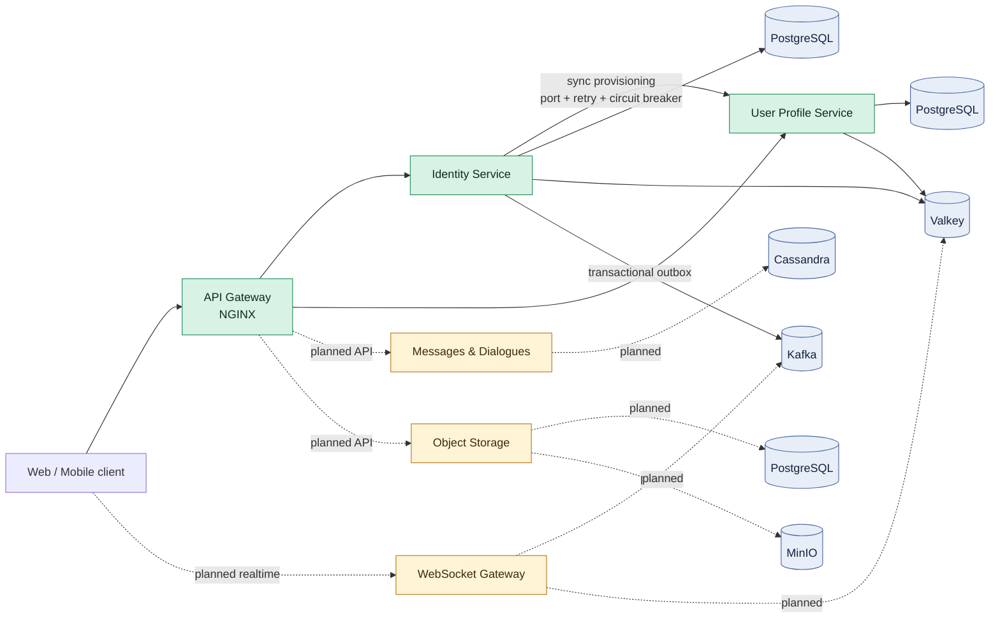

# Andruha Messenger

Andruha Messenger — учебно-практический MVP мессенджера на микросервисной архитектуре. Этот репозиторий является **интеграционным**: он фиксирует совместимые версии сервисов через Git submodules, хранит межсервисные контракты, общую документацию и локальную Docker Compose-топологию.

## Текущий статус

| Компонент | Назначение | Статус |
|---|---|---|
| [API Gateway](services/api-gateway) | NGINX-маршрутизация и доверенная передача авторизации | готов для текущих HTTP API |
| [Identity Service](services/identity-service) | регистрация, вход, сессии, refresh/logout, публикация событий | готов для MVP |
| [User Profile Service](services/user-profile-service) | профили, настройки приватности и внутренний provisioning | готов для MVP |
| [Messages and Dialogues](services/messages-dialogues-service) | диалоги, сообщения и статусы прочтения | операционный каркас |
| [WebSocket Gateway](services/websocket-gateway-service) | realtime-соединения и доставка | операционный каркас |
| [Object Storage](services/object-storage-service) | метаданные и доступ к медиа | операционный каркас |

Готовый вертикальный срез сейчас — регистрация и аутентификация пользователя с синхронным созданием профиля. Таблица не выдает health-check каркаса за готовую бизнес-функцию.

## Компонентная схема



Сплошные связи отражают уже подключенный MVP-срез. Пунктиром обозначены границы и инфраструктура для следующих итераций.

## Стек

- Python 3.14, FastAPI, Pydantic, Dishka, SQLAlchemy, Alembic;
- PostgreSQL для транзакционных данных, Valkey для быстрого идемпотентного пути;
- Kafka в KRaft-режиме и FastStream для событий;
- NGINX как API Gateway;
- Cassandra и MinIO в целевой локальной топологии сообщений и медиа;
- Poetry, pytest, Ruff, ty, pip-audit, Docker и GitHub Actions.

## Как начать

Нужны Git, Docker Compose, OpenSSL, Python 3.14 и Poetry 2.4+.

```powershell
git clone --recurse-submodules https://github.com/yemeal/andruha-messenger.git
Set-Location andruha-messenger
Copy-Item .env.example .env
docker compose config --quiet
docker compose build
```

Если репозиторий уже клонирован, синхронизируйте именно зафиксированные версии сервисов:

```powershell
git pull
git submodule sync --recursive
git submodule update --init --recursive
```

Корневой `docker-compose.yml` описывает локальную интеграционную топологию. Перед запуском Identity необходимо создать файлы из секций `secrets` и `configs` (`.secrets/identity/`) и задать сервисные секреты. Детальные переменные, миграции и команды запуска находятся в README соответствующего сервиса:

```powershell
New-Item -ItemType Directory -Force .secrets/identity
openssl genpkey -algorithm RSA -pkeyopt rsa_keygen_bits:2048 -out .secrets/identity/jwt-private.pem
openssl rsa -pubout -in .secrets/identity/jwt-private.pem -out .secrets/identity/jwt-public.pem
openssl rand -out .secrets/identity/replay-v1.key 32
docker compose up -d --wait
Invoke-WebRequest http://localhost:8080/health/ready
docker compose down
```

Значения из `.env.example` предназначены только для локальной разработки; в
общем или production-окружении пароли и `PROFILE_PROVISIONING_TOKEN` необходимо
заменить.

Детальные переменные и команды сервиса:

- [Identity Service](services/identity-service/README.md)
- [User Profile Service](services/user-profile-service/README.md)

Локальная проверка отдельного Python-сервиса:

```powershell
Set-Location services/identity-service
poetry sync --with dev --no-root
poetry run pytest
```

Обновлять submodule на произвольный последний commit не следует: корневой commit фиксирует проверенную комбинацию версий.

## Интересные решения

- **Синхронная регистрация без распределенной транзакции.** Identity вызывает Profile через application port; адаптер защищен bounded retry и circuit breaker. Успешная регистрация означает, что профиль уже создан.
- **Устойчивое восстановление.** Registration operation, lease/fencing и reconciler повторяют идемпотентный provisioning после таймаута, падения процесса или неоднозначного commit.
- **Надежные события.** Пользователь и событие создаются в одной PostgreSQL-транзакции, затем outbox relay доставляет событие в Kafka с семантикой at-least-once.
- **Идемпотентность и защита replay.** PostgreSQL хранит durable-результат, Valkey ускоряет повторные запросы, чувствительный replay шифруется AES-256-GCM.
- **Гексагональная архитектура.** Домен и application layer не зависят от HTTP, Kafka, Redis или PostgreSQL; внешние системы подключаются адаптерами через порты.
