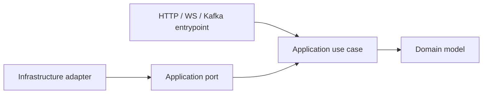
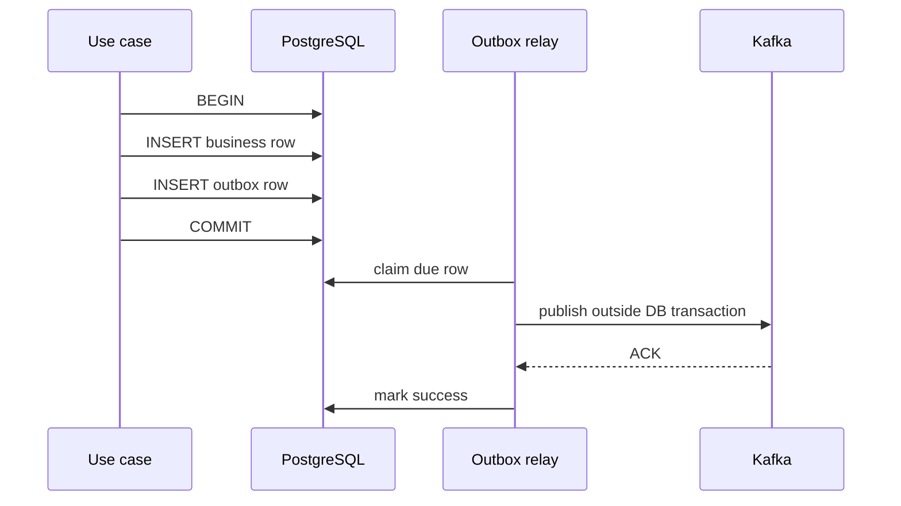

# 00. Инженерная база и рабочий цикл

## Цель главы

Эта глава объясняет минимальную теорию, которая нужна до написания бизнес-кода.
Её результат — одинаковая структура всех сервисов и понимание того, где должна
находиться каждая часть логики.

## 1. Сначала вертикальный срез, потом масштаб

Вертикальный срез — один сценарий, который проходит через все необходимые
слои и реальные adapters. Например:

```text
PATCH /profiles/me
  -> FastAPI schema
  -> UpdateOwnProfile use case
  -> Profile domain rules
  -> ProfileRepository port
  -> SQLAlchemy adapter
  -> PostgreSQL
  -> HTTP response + ETag
```

Первый срез должен быть маленьким, но настоящим. Нельзя сначала написать все
entities, затем все repositories, затем все routers: ошибки границ обнаружатся
слишком поздно.

Для каждого среза используй цикл:

1. Записать наблюдаемое поведение и failure paths.
2. Написать application test через fake ports.
3. Добавить domain/value objects.
4. Реализовать use case.
5. Реализовать один adapter.
6. Добавить integration test с реальной зависимостью.
7. Подключить transport и contract test.
8. Запустить весь service suite.
9. Обновить README и только потом закрыть карточку.

## 2. DDD без лишней церемонии

DDD в этом проекте означает не большое количество классов, а явные владельцы
правил и терминов.

### Entity

Entity имеет устойчивую identity и жизненный цикл. Примеры:

- `Profile(user_id)`;
- `Dialog(dialog_id)`;
- `Message(message_id)`;
- `StoredObject(object_id)`.

### Value Object

Value object определяется значением и проверяет собственную корректность:

```python
from dataclasses import dataclass


@dataclass(frozen=True, slots=True)
class DisplayName:
    value: str

    def __post_init__(self) -> None:
        normalized = " ".join(self.value.split())
        if not 1 <= len(normalized) <= 64:
            raise InvalidDisplayNameError()
        object.__setattr__(self, "value", normalized)
```

Transport не должен обходить этот инвариант. Pydantic проверяет форму запроса,
а domain value object — бизнес-смысл.

### Aggregate

Aggregate — граница согласованного изменения. В PostgreSQL это часто совпадает
с transaction boundary. В Cassandra aggregate должен дополнительно учитывать
partition boundary.

Не создавай aggregate «Messenger». Примеры допустимых границ:

- `Profile` и его version;
- Cassandra session family в одной partition;
- receipt watermarks одного dialog;
- upload intent одного object.

### Domain Service

Domain service нужен только когда правило относится к нескольким domain
objects и естественного владельца нет. Network/database вызовы domain service
не делает.

## 3. Hexagonal architecture

Одинаковая структура сервисов уже создана:

```text
src/app/
  domain/          # правила, entities, value objects, domain errors
  application/     # use cases, ports, commands/results
  infrastructure/  # PostgreSQL/Cassandra/Kafka/Valkey/MinIO adapters, DI
  entrypoints/      # HTTP, WebSocket, Kafka translation
  core/             # settings, logging, process-level configuration
```

Главное правило — зависимость направлена внутрь.



### Application port

Port описывает, что нужно use case, а не методы конкретной базы:

```python
from typing import Protocol
from uuid import UUID


class ProfileRepository(Protocol):
    async def get_by_user_id(self, user_id: UUID) -> Profile | None: ...

    async def add(self, profile: Profile) -> None: ...

    async def update_if_version(
        self,
        profile: Profile,
        expected_version: int,
    ) -> bool: ...
```

Плохо:

```python
class ProfileRepository(Protocol):
    async def execute_sql(self, query: str) -> list[dict]: ...
```

Такой port протаскивает технологию внутрь application layer.

### Use case

Use case получает простую command DTO и возвращает result DTO:

```python
from dataclasses import dataclass
from uuid import UUID


@dataclass(frozen=True, slots=True)
class UpdateOwnProfileCommand:
    user_id: UUID
    expected_version: int
    display_name: str | None
    bio: str | None
    locale: str | None


class UpdateOwnProfile:
    def __init__(self, uow: ProfileUnitOfWork) -> None:
        self._uow = uow

    async def execute(self, command: UpdateOwnProfileCommand) -> ProfileView:
        async with self._uow:
            profile = await self._uow.profiles.get_by_user_id(command.user_id)
            if profile is None:
                raise ProfileNotFoundError()

            profile.apply_patch(
                display_name=command.display_name,
                bio=command.bio,
                locale=command.locale,
            )
            updated = await self._uow.profiles.update_if_version(
                profile,
                expected_version=command.expected_version,
            )
            if not updated:
                raise ProfileVersionConflictError()

            await self._uow.commit()
            return ProfileView.from_domain(profile)
```

FastAPI `Request`, `Response`, headers и status codes сюда не передаются.

## 4. Где заканчивается валидация transport

Разделяй три уровня:

| Уровень | Пример | Кто проверяет |
|---|---|---|
| Синтаксис | JSON, UUID, обязательное поле | Pydantic/entrypoint |
| Бизнес-инвариант | Нельзя создать dialog с собой | Domain/application |
| Авторизация | Caller является participant | Application + repository data |

Transport может отклонить frame размером больше лимита, но не должен решать,
является ли sender участником dialog.

## 5. Unit of Work и транзакции PostgreSQL

Unit of Work объединяет repositories, использующие один `AsyncSession`:

```python
from types import TracebackType


class SqlAlchemyUnitOfWork:
    def __init__(self, session: AsyncSession) -> None:
        self._session = session
        self.profiles = SqlAlchemyProfileRepository(session)
        self.processed_events = SqlAlchemyProcessedEventRepository(session)

    async def __aenter__(self) -> "SqlAlchemyUnitOfWork":
        return self

    async def __aexit__(
        self,
        exc_type: type[BaseException] | None,
        exc: BaseException | None,
        tb: TracebackType | None,
    ) -> None:
        if exc is not None:
            await self._session.rollback()

    async def commit(self) -> None:
        await self._session.commit()

    async def rollback(self) -> None:
        await self._session.rollback()
```

Правила:

- один request/message task — один `AsyncSession`;
- `AsyncSession` нельзя использовать одновременно из нескольких
  `asyncio` tasks;
- Argon2, Kafka, Object Storage и внешний HTTP не выполняются внутри SQL
  transaction;
- transaction должна быть короткой;
- database uniqueness является последней защитой от race, даже если перед
  insert был `SELECT`.

SQLAlchemy прямо описывает `AsyncSession` как mutable transaction state и
требует отдельную session на task. См.
[официальную asyncio-документацию](https://docs.sqlalchemy.org/en/20/orm/extensions/asyncio.html).

## 6. Почему обычный `SELECT`, затем `INSERT` не защищает от гонки

Два процесса могут одновременно увидеть отсутствие строки:

```text
T1: SELECT -> none
T2: SELECT -> none
T1: INSERT
T2: INSERT
```

Защита:

- PostgreSQL unique constraint + обработка `IntegrityError`;
- `INSERT ... ON CONFLICT`;
- Cassandra `INSERT ... IF NOT EXISTS` для редкой reservation-операции.

Distributed lock не заменяет durable unique invariant.

## 7. Идемпотентность

Идемпотентная операция даёт один и тот же наблюдаемый результат при безопасном
повторе.

Для command нужны два значения:

1. operation identity: например `(sender_id, client_message_id)`;
2. request fingerprint: hash канонического смыслового payload.

```python
import hashlib
import json
from collections.abc import Mapping
from typing import Any


def canonical_sha256(payload: Mapping[str, Any]) -> bytes:
    encoded = json.dumps(
        payload,
        ensure_ascii=False,
        sort_keys=True,
        separators=(",", ":"),
    ).encode("utf-8")
    return hashlib.sha256(encoded).digest()
```

Результаты:

| Состояние | Поведение |
|---|---|
| Identity отсутствует | Выполнить впервые |
| Identity есть, fingerprint совпадает | Вернуть/восстановить прежний результат |
| Identity есть, fingerprint отличается | Conflict, не выполнять |
| Результат неизвестен после timeout | Прочитать durable state, а не создавать новый ID |

Не хэшируй сырое JSON-представление transport, если порядок или default fields
могут меняться. Сначала построй semantic payload.

## 8. At-least-once и effectively-once local effect

Kafka может доставить command/event повторно. Правильная формулировка гарантии:

```text
at-least-once transport
+ durable idempotency fence
+ atomic local transaction или repairable projection
= effectively-once committed local effect
```

Это не Exactly Once для всей распределённой системы.

Consumer должен различать:

- permanent rejection: неправильный contract, unsupported version,
  неавторизованный business command;
- transient failure: Cassandra/PostgreSQL/Kafka timeout;
- poison message: envelope невозможно безопасно разобрать.

Permanent business rejection публикует typed rejection и подтверждает command.
Transient failure не подтверждает offset. Poison message переносится в DLQ
только после успешной публикации DLQ envelope.

## 9. Transactional outbox

Outbox нужен, когда PostgreSQL state и Kafka event должны логически появиться
вместе.



Relay может упасть после Kafka ACK, но до `mark success`. Тогда event будет
опубликован снова. Поэтому consumer обязан иметь Inbox/`processed_events`.

## 10. Cassandra — не PostgreSQL без JOIN

В Cassandra таблица проектируется от конкретного запроса:

```text
access pattern -> partition key -> clustering order -> bounded partition
```

Нормально хранить одно сообщение в нескольких таблицах-проекциях. Ненормально
надеяться на JOIN, `ALLOW FILTERING` или cluster scan.

Основные понятия:

- partition key определяет узлы, где лежат строки;
- clustering columns определяют порядок строк внутри partition;
- consistency level определяет число ответивших replicas;
- LWT даёт compare-and-set, но дороже обычной записи;
- cross-partition writes не образуют обычную реляционную transaction;
- временные данные нужно bucket-ировать, чтобы partition не росла бесконечно.

Официальная документация подтверждает, что быстрый запрос содержит partition
key, а LWT обеспечивает single-partition compare-and-set:
[Cassandra architecture](https://cassandra.apache.org/doc/latest/cassandra/architecture/overview.html) и
[CQL data definition](https://cassandra.apache.org/doc/latest/cassandra/developing/cql/ddl.html).

## 11. Eventual consistency и repair

Если один command пишет четыре Cassandra projection, часть записей может пройти,
а часть — завершиться timeout. Источником repair должен быть канонический
idempotency snapshot:

```text
reserve canonical snapshot with LWT
  -> upsert projection A
  -> upsert projection B
  -> upsert projection C
  -> publish deterministic event
```

После redelivery handler загружает тот же snapshot и повторяет UPSERT. Он не
генерирует новый `message_id`, timestamp или event ID.

## 12. Asyncio и блокирующие библиотеки

`async def` не делает синхронную библиотеку неблокирующей.

В event loop нельзя напрямую выполнять:

- Argon2 hashing;
- синхронный MinIO/S3 network call;
- длительную CPU-обработку изображения;
- блокирующий Cassandra `execute()`.

Используй native async API, callback-to-Future bridge или ограниченный worker
pool. Лимит должен быть явным, иначе overload создаст бесконечную очередь.

```python
import asyncio
from collections.abc import Callable
from typing import TypeVar

T = TypeVar("T")


class BoundedBlockingRunner:
    def __init__(self, concurrency: int) -> None:
        self._slots = asyncio.Semaphore(concurrency)

    async def run(self, func: Callable[[], T]) -> T:
        async with self._slots:
            return await asyncio.to_thread(func)
```

## 13. Ошибки и стабильные коды

Domain/application exception не должен знать HTTP status:

```python
class DialogNotFoundError(DomainError):
    code = "dialog.not_found"
```

HTTP mapper решает, что private missing/forbidden — это `404`. WebSocket mapper
делает frame `error.v1`. Kafka consumer создаёт `message.rejected.v1`.

Один domain error может иметь разные transport representations, не меняя
бизнес-смысл.

## 14. Минимальная тестовая пирамида

### Domain tests

Проверяют чистые правила без mocks базы:

- normalization;
- state transition;
- message content invariant;
- status monotonicity;
- ownership/purpose rules.

### Application tests

Используют fake ports и проверяют orchestration:

- какой repository вызван;
- где commit/rollback;
- что network call не происходит после rejection;
- повторный command возвращает прежний результат.

### Adapter integration tests

Работают с реальным PostgreSQL, Cassandra, Kafka, Valkey или MinIO:

- реальные constraints/LWT;
- реальный broker ACK/redelivery;
- реальный Lua/TTL/PubSub;
- реальные S3 metadata и presigned requests.

### Contract tests

Проверяют JSON Schema/OpenAPI, version discriminator, обязательные поля и
запрет неизвестной версии.

### End-to-end

Проверяют только ключевые сквозные сценарии через API Gateway. E2E не заменяет
unit/integration tests, потому что плохо локализует причину сбоя.

## 15. Рабочая дисциплина в отдельных репозиториях

Каждый milestone обычно затрагивает несколько Git repositories. Работай так:

1. Сначала contract change в superproject.
2. Затем producer repository.
3. Затем consumer repository.
4. Затем Compose/integration test в superproject.
5. В каждом repository — отдельный commit с одной причиной изменения.
6. Superproject обновляет submodule pointers только после готовности service
   commits.

Нельзя коммитить submodule pointer, который ссылается на локальный, не
опубликованный commit, если другие разработчики должны собрать проект.

## 16. Контрольная точка главы

Перед переходом к контрактам ты должен уметь ответить:

- кто владеет каждым бизнес-правилом;
- почему port находится в application, а adapter — в infrastructure;
- где проходит PostgreSQL transaction boundary;
- почему Kafka event может прийти дважды;
- чем idempotency отличается от distributed lock;
- почему Cassandra table начинается с access pattern;
- как система восстанавливается после partial projection write;
- почему WebSocket push нельзя считать durable delivery.

