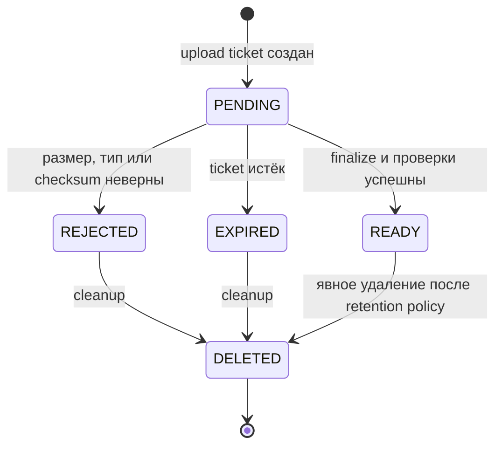

# 5. Object Storage Service: загрузка и выдача медиа

## Результат этапа

После этой главы пользователь может:

1. получить одноразовый upload ticket;
2. напрямую загрузить файл в MinIO по presigned URL;
3. финализировать загрузку;
4. прикрепить готовый объект к сообщению или использовать его как аватар;
5. скачать объект только после проверки права доступа бизнес-сервисом.

Сам файл не проходит через API Gateway и Python-сервисы. Через них проходят только метаданные и короткие управляющие запросы.

> Этот этап начинается после текстовых сообщений и Profile. Сначала докажите основной пользовательский путь без медиа.

## 5.1. Граница ответственности

Object Storage Service отвечает за:

- выдачу короткоживущих presigned URL;
- серверную генерацию bucket/key;
- метаданные объекта и его жизненный цикл;
- проверку владельца, назначения, размера, типа и checksum;
- выдачу короткоживущей download-ссылки после авторизации;
- удаление просроченных незавершённых загрузок.

Он **не** отвечает за:

- существование диалога и членство в нём;
- право читать конкретное сообщение;
- выбор текущего аватара профиля;
- хранение бинарного файла в PostgreSQL;
- преобразование видео, превью и антивирус в MVP.

Право на бизнес-действие проверяет владеющий агрегатом сервис:

```text
Client -> Messages: можно ли скачать attachment этого сообщения?
Messages -> Object Storage: подпиши object_id для user_id
Object Storage -> Messages: короткий download URL
Messages -> Client: URL
```

Так Object Storage знает владельца файла, но не копирует к себе модель диалогов.

## 5.2. Жизненный цикл объекта



В MVP cleanup автоматически удаляет только `PENDING`, `REJECTED` и `EXPIRED`. Готовые (`READY`) объекты автоматически не удаляются: без распределённого учёта ссылок это может уничтожить медиа существующего сообщения. Сбор неиспользуемых `READY`-объектов — отдельная будущая задача с reconciliation.

## 5.3. PostgreSQL-схема метаданных

```sql
CREATE TYPE object_purpose AS ENUM ('avatar', 'message_attachment');
CREATE TYPE object_status AS ENUM ('pending', 'ready', 'rejected', 'expired', 'deleted');

CREATE TABLE stored_objects (
    object_id uuid PRIMARY KEY,
    owner_id uuid NOT NULL,
    purpose object_purpose NOT NULL,
    status object_status NOT NULL,
    bucket_name text NOT NULL,
    object_key text NOT NULL UNIQUE,
    original_filename text,
    declared_media_type text NOT NULL,
    detected_media_type text,
    expected_size_bytes bigint NOT NULL CHECK (expected_size_bytes > 0),
    actual_size_bytes bigint,
    expected_sha256 bytea NOT NULL,
    actual_sha256 bytea,
    storage_etag text,
    version bigint NOT NULL DEFAULT 1,
    upload_expires_at timestamptz NOT NULL,
    finalized_at timestamptz,
    rejected_reason_code text,
    created_at timestamptz NOT NULL,
    updated_at timestamptz NOT NULL
);

CREATE INDEX ix_stored_objects_owner_created
    ON stored_objects (owner_id, created_at DESC);
CREATE INDEX ix_stored_objects_cleanup
    ON stored_objects (status, upload_expires_at)
    WHERE status IN ('pending', 'rejected', 'expired');
```

`object_key` генерирует сервер, например:

```text
message/2026/08/7f/0198...uuid
avatar/2026/08/7f/0198...uuid
```

Имя пользователя не попадает в key. `original_filename` — только отображаемая метаинформация: удалите управляющие символы, ограничьте длину и никогда не используйте его как путь.

Для повторов `POST /uploads` и `POST /objects/{id}/finalize` нужен durable idempotency record в PostgreSQL:

```sql
CREATE TABLE idempotency_records (
    owner_id uuid NOT NULL,
    operation text NOT NULL,
    idempotency_key uuid NOT NULL,
    request_hash bytea NOT NULL,
    resource_id uuid,
    state text NOT NULL CHECK (state IN ('processing', 'completed', 'failed')),
    response_status integer,
    created_at timestamptz NOT NULL,
    expires_at timestamptz NOT NULL,
    PRIMARY KEY (owner_id, operation, idempotency_key)
);
```

Тот же ключ с другим `request_hash` возвращает `409 storage.idempotency_conflict`. После потери HTTP-ответа сервис восстанавливает ответ из `resource_id`, а не создаёт второй объект.

## 5.4. Контракты API

### Создать upload ticket

```http
POST /api/v1/storage/uploads
Authorization: Bearer <access-token>
Idempotency-Key: 0198...
Content-Type: application/json

{
  "purpose": "message_attachment",
  "filename": "photo.webp",
  "media_type": "image/webp",
  "size_bytes": 482193,
  "sha256_base64": "v0bu...="
}
```

```json
{
  "object_id": "0198...",
  "status": "pending",
  "upload": {
    "method": "PUT",
    "url": "https://storage.example/...signature...",
    "headers": {
      "Content-Type": "image/webp",
      "x-amz-checksum-sha256": "v0bu...="
    },
    "expires_at": "2026-08-17T10:10:00Z"
  }
}
```

### Финализировать загрузку

```http
POST /api/v1/storage/objects/{object_id}/finalize
Authorization: Bearer <access-token>
Idempotency-Key: 0198...
```

Успех:

```json
{
  "object_id": "0198...",
  "status": "ready",
  "media_type": "image/webp",
  "size_bytes": 482193,
  "sha256_base64": "v0bu...="
}
```

Идемпотентный повтор возвращает тот же `200`. Возможные ошибки:

- `404 storage.object_not_found` — не раскрывать чужой объект;
- `409 storage.object_not_pending` — недопустимый переход;
- `410 storage.upload_expired`;
- `422 storage.size_mismatch`;
- `422 storage.checksum_mismatch`;
- `422 storage.media_type_mismatch`;
- `503 storage.backend_unavailable`.

### Внутренняя проверка объекта

```http
POST /internal/v1/storage/objects/validate-use
X-Service-Identity: <service credential>

{
  "object_ids": ["0198..."],
  "owner_id": "user-uuid",
  "purpose": "message_attachment"
}
```

Ответ содержит immutable snapshot: `object_id`, `media_type`, `size_bytes`, `sha256`. Messages сохраняет этот snapshot вместе с сообщением, чтобы история не зависела от последующего изменения metadata API.

### Скачать объект

Публичный клиент не вызывает Object Storage напрямую для авторизации:

```http
GET /api/v1/messages/{message_id}/attachments/{object_id}/download
```

Messages проверяет участника диалога и вызывает:

```http
POST /internal/v1/storage/objects/{object_id}/download-ticket
```

Object Storage повторно проверяет, что объект `READY`, и возвращает URL с TTL. Для собственного аватара аналогично действует Profile. Публичный avatar может иметь отдельную кешируемую policy позже; в MVP не делайте bucket публичным.

## 5.5. Базовые лимиты MVP

Это исходные конфигурируемые значения, а не навсегда зафиксированные продуктовые правила:

| Назначение | Размер одного файла | Количество | Разрешённые типы |
|---|---:|---:|---|
| avatar | 5 MiB | 1 активный | JPEG, PNG, WebP |
| message attachment | 25 MiB | до 4 на сообщение | JPEG, PNG, WebP, GIF, MP4, MP3, OGG, PDF |

Дополнительно:

- суммарно не более 50 MiB на сообщение;
- upload ticket живёт 10 минут;
- download ticket живёт 5 минут;
- лимит создаваемых ticket на пользователя задаётся конфигурацией;
- сервер проверяет allow-list, а не запрещающий список.

Уточнение продуктовых лимитов — `TBD-004`. Реализация лимитов всё равно обязательна: меняются значения конфигурации, не механизм.

## 5.6. Happy path без длинной DB-транзакции

Нельзя держать `SELECT ... FOR UPDATE` во время сетевого `HEAD` или чтения MinIO.

Правильный finalize:

1. коротко прочитать `PENDING`-строку и её `version`;
2. закрыть транзакцию;
3. выполнить `HEAD` к MinIO и, при необходимости, ограниченное чтение magic bytes;
4. сравнить размер, checksum и тип;
5. открыть короткую транзакцию;
6. выполнить compare-and-set:

```sql
UPDATE stored_objects
SET status = 'ready',
    actual_size_bytes = :size,
    actual_sha256 = :sha256,
    detected_media_type = :media_type,
    storage_etag = :etag,
    finalized_at = now(),
    updated_at = now(),
    version = version + 1
WHERE object_id = :object_id
  AND owner_id = :owner_id
  AND status = 'pending'
  AND version = :expected_version;
```

7. если обновлена одна строка — вернуть `READY`;
8. если ноль — перечитать состояние: конкурент мог уже успешно финализировать объект.

Это optimistic concurrency. Сетевой вызов не блокирует строку PostgreSQL.

## 5.7. Порты гексагональной архитектуры

```python
from dataclasses import dataclass
from datetime import datetime, timedelta
from typing import Protocol
from uuid import UUID


@dataclass(frozen=True, slots=True)
class StorageHead:
    size_bytes: int
    etag: str
    checksum_sha256: bytes | None
    content_type: str | None


class BlobStorage(Protocol):
    async def presign_put(
        self,
        *,
        bucket: str,
        key: str,
        expires: timedelta,
        content_type: str,
        checksum_sha256: bytes,
    ) -> str: ...

    async def head(self, *, bucket: str, key: str) -> StorageHead: ...

    async def presign_get(
        self, *, bucket: str, key: str, expires: timedelta
    ) -> str: ...

    async def delete(self, *, bucket: str, key: str) -> None: ...


class Clock(Protocol):
    def now(self) -> datetime: ...


class ObjectRepository(Protocol):
    async def add(self, obj: "StoredObject") -> None: ...
    async def get_owned(self, object_id: UUID, owner_id: UUID) -> "StoredObject | None": ...
    async def mark_ready_if_version(self, ...) -> bool: ...
```

Application use case зависит от этих портов, а не от MinIO SDK, SQLAlchemy или FastAPI. MinIO/S3 adapter переводит ошибки SDK в стабильные application errors.

Пример только для знакомства с SDK:

```python
from datetime import timedelta
from minio import Minio

client = Minio(
    "minio:9000",
    access_key="...",
    secret_key="...",
    secure=False,
)

url = client.presigned_put_object(
    "andruha-media",
    "message/2026/08/7f/object-id",
    expires=timedelta(minutes=10),
)
```

SDK синхронный. В async-приложении запускайте такой вызов через ограниченный thread pool либо используйте совместимый async adapter. Не вызывайте блокирующий SDK прямо в event loop.

Presigned URL — bearer capability: любой, кто получил URL до истечения срока, может его использовать. Поэтому URL короткоживущий, не логируется и передаётся только по TLS. Официальные детали: [S3 presigned URLs](https://docs.aws.amazon.com/AmazonS3/latest/userguide/using-presigned-url.html), [проверка checksum в S3](https://docs.aws.amazon.com/AmazonS3/latest/userguide/checking-object-integrity-upload.html), [MinIO Python API](https://docs.min.io/aistor/developers/sdk/python/api/).

## 5.8. Проверка содержимого

`Content-Type` от клиента и metadata объекта недостоверны.

Минимум для MVP:

1. проверить `Content-Length`/размер из `HEAD`;
2. проверить SHA-256, если backend возвращает checksum;
3. прочитать ограниченное начало объекта и определить magic signature;
4. для аватара прочитать файл целиком в пределах 5 MiB, декодировать изображение и проверить максимальные dimensions/pixel count;
5. при несоответствии перевести объект в `REJECTED` и удалить blob асинхронно.

Если конкретная версия MinIO не возвращает нужный checksum в `HEAD`, это не повод молча пропустить проверку. Возможны два adapter-а:

- подписывать обязательный checksum header и проверять совместимость интеграционным тестом;
- потоково прочитать объект с жёстким size limit и вычислить SHA-256 на сервере.

Выбор фиксируется тестом совместимости, а не предположением.

Антивирус, модерация, thumbnails и transcoding — post-MVP. Для них позже появится асинхронное состояние `PROCESSING`; сейчас не добавляйте его заранее.

## 5.9. Связь с Profile и Messages

### Аватар

1. клиент загружает объект с `purpose=avatar`;
2. финализирует его;
3. отправляет `PATCH /api/v1/profile/me` с `avatar_object_id`;
4. Profile вызывает `validate-use(owner_id, avatar)`;
5. Profile обновляет ссылку с optimistic concurrency;
6. прежний объект остаётся `READY` в MVP.

### Attachment

1. клиент загружает и финализирует все объекты;
2. отправляет message command с `attachment_ids`;
3. Messages проверяет участника диалога;
4. Messages вызывает batch `validate-use` с коротким timeout;
5. только после успешной проверки резервирует idempotency key и записывает сообщение;
6. событие `message.created.v1` содержит immutable attachment snapshot.

Если Object Storage недоступен, сообщение с attachments не принимается: `503 messaging.attachment_validation_unavailable`. Текстовое сообщение от Object Storage не зависит.

## 5.10. Cleanup worker

Отдельный процесс `object-storage-cleanup`:

1. забирает небольшую пачку просроченных строк через `FOR UPDATE SKIP LOCKED` и lease;
2. помечает `expired`;
3. закрывает DB-транзакцию;
4. удаляет blob;
5. помечает `deleted` короткой транзакцией;
6. повторяет transient errors с backoff.

Ошибка удаления не должна откатывать уже истёкший ticket. `DELETE` в S3/MinIO рассматривайте как идемпотентный: отсутствие объекта — успех cleanup.

## 5.11. Health, readiness и метрики

`object-storage-api`:

- liveness: процесс и event loop живы;
- readiness: PostgreSQL доступен, bucket существует, MinIO отвечает на дешёвую metadata-операцию;
- не загружать тестовый объект на каждый probe.

`object-storage-cleanup`:

- отдельный внутренний ops endpoint;
- readiness: PostgreSQL и MinIO;
- heartbeat последнего успешного цикла.

Метрики:

- `storage_upload_ticket_total{purpose,result}`;
- `storage_finalize_total{result}`;
- `storage_finalize_duration_seconds`;
- `storage_pending_objects`;
- `storage_cleanup_lag_seconds`;
- `storage_backend_errors_total{operation}`;
- размер загрузок histogram с ограниченной cardinality.

Не помещайте `user_id`, `object_id`, filename или URL в labels метрик.

## 5.12. Тесты и критерии готовности

### Unit

- матрица purpose/type/size;
- неправильный checksum;
- истёкший ticket;
- повтор finalize после успеха;
- конкурентный finalize;
- чужой object маскируется как `404`;
- formatter key не использует filename.

### Integration

- PostgreSQL idempotency conflict/replay;
- presigned PUT в реальный MinIO из Compose;
- обязательные headers действительно входят в подпись;
- `HEAD` возвращает ожидаемые size/checksum/etag;
- cleanup удаляет только незавершённый объект;
- MinIO timeout не удерживает DB lock.

### End-to-end

- upload → finalize → avatar PATCH → profile GET;
- upload → finalize → message send → recipient sync → download;
- иностранный attachment отклонён;
- неготовый attachment отклонён;
- потерянный ответ finalize безопасно повторяется.

### Gate `G6`

Этап готов, только если:

- bucket private;
- бинарные данные обходят Gateway и app service;
- filename не определяет storage key;
- finalize идемпотентен и не держит DB-транзакцию через network I/O;
- Messages/Profile проверяют назначение и владельца;
- download требует бизнес-авторизации;
- очистка не удаляет `READY` без доказательства отсутствия ссылки.
