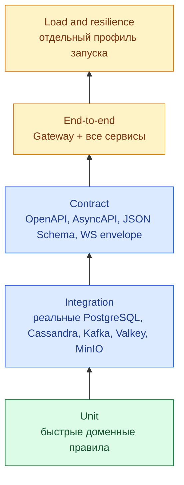

# 6. Сквозная проверка, эксплуатация и путь к масштабу

## Результат этапа

Эта глава превращает набор работающих сервисов в проверяемую систему. После неё у проекта есть:

- воспроизводимый локальный запуск;
- минимальный reference client для HTTP и WebSocket;
- тесты контрактов и главных пользовательских сценариев;
- единые health/readiness/logging/request ID;
- измеримый baseline производительности;
- понятный путь от single-node Compose к self-hosted HA;
- честная граница между `MVP работает` и `система доказанно выдерживает нагрузку`.

## 6.1. Что означает «MVP готов»

MVP готов не тогда, когда каждый endpoint один раз ответил `200`, а когда следующий сценарий воспроизводится с нуля:

1. запустить инфраструктуру и применить схемы;
2. зарегистрировать Алису и Боба;
3. получить профили, автоматически созданные событием регистрации;
4. Алисе изменить имя и аватар;
5. открыть два WebSocket-соединения;
6. создать личный диалог;
7. отправить текстовое сообщение;
8. повторить тот же command и не получить дубликат;
9. Бобу получить сообщение online;
10. переподключить Боба и восстановить событие через `/sync`;
11. отправить delivered/read receipts;
12. Алисе увидеть монотонные статусы;
13. увидеть typing start/stop без durable-записи;
14. загрузить attachment, отправить его и скачать с проверкой доступа;
15. повторить ключевые операции после кратковременного отказа Kafka/Valkey/MinIO.

Этот сценарий хранится как автоматизируемый smoke/E2E test, а не только как инструкция человеку.

## 6.2. Слои тестирования



### Unit

Проверяют domain/application без сети и БД:

- state transitions;
- policy доступа;
- idempotency decision;
- cursor encode/decode;
- message/status monotonicity;
- лимиты и rate-limit arithmetic;
- mapping domain errors.

### Integration

Запускают настоящую технологию, поведение которой нельзя честно подменить SQLite/mock:

- PostgreSQL constraints, locks и transaction isolation;
- Cassandra partition/order/LWT/TTL;
- Kafka key ordering, redelivery, commit offset;
- Valkey Lua/rate limit/Pub/Sub;
- MinIO presigned signature и checksum.

### Contract

Проверяют:

- OpenAPI валиден;
- examples соответствуют JSON Schema;
- producer payload проходит consumer schema;
- новое событие обратно совместимо в пределах major version;
- WS envelope одинаков у Gateway и reference client;
- `error.code` стабилен.

### End-to-end

Проверяют бизнес-путь через внешний Gateway. Они не должны обращаться прямо к таблицам, кроме setup/diagnostics fixture.

### Load/resilience

Не входят в каждый unit CI job. Запускаются отдельно на контролируемом окружении, сохраняют конфигурацию, commit SHA и результаты.

## 6.3. Testcontainers и Compose

Для тестов отдельного сервиса предпочтительны Testcontainers или аналогичный fixture: тест сам поднимает нужную версию БД и не зависит от вручную оставленного контейнера.

Для сквозного теста используется root Compose profile:

```text
docker compose --profile app --profile test up --build --wait
```

Фактическую команду зафиксируйте после того, как profiles будут добавлены. Не копируйте эту строку в CI до проверки `docker compose config`.

Нужны отдельные роли/контейнеры:

- `identity-api`, `identity-outbox-relay`;
- `profile-api`, `profile-consumer`;
- `messages-api`, `messages-consumer`, `messages-repair`;
- `websocket-api`, `websocket-dispatcher`;
- `object-storage-api`, `object-storage-cleanup`;
- infrastructure services.

Один image на репозиторий допустим; роль выбирается `command`. В production-like окружении каждый процесс масштабируется независимо.

## 6.4. Reference client

Production frontend сейчас не входит в подтверждённый scope. Чтобы руками и E2E проверить систему, создайте в основном репозитории `tools/reference-client/`:

```text
tools/reference-client/
├── README.md
├── pyproject.toml
├── src/reference_client/
│   ├── http.py
│   ├── websocket.py
│   ├── scenarios.py
│   └── __main__.py
└── tests/
```

Он умеет:

- register/login и хранение cookie только в памяти;
- HTTP profile/dialog/message/storage calls;
- WebSocket connect/reconnect;
- печать `request_id`, `event_id`, `cursor`;
- выполнение сценария `two-users-chat`;
- искусственно не ACK-ать/разрывать соединение.

Минимальный WS loop:

```python
import asyncio
import json
import websockets


async def receive_forever(url: str, cookie_header: str) -> None:
    backoff = 0.5
    last_cursor: str | None = None

    while True:
        try:
            async with websockets.connect(
                url,
                additional_headers={"Cookie": cookie_header},
                origin="http://localhost:8080",
                ping_interval=None,
                max_size=1_048_576,
            ) as socket:
                backoff = 0.5
                await socket.send(json.dumps({
                    "type": "connection.init",
                    "request_id": "client-generated-uuid",
                    "payload": {"last_cursor": last_cursor},
                }))

                async for raw in socket:
                    event = json.loads(raw)
                    if cursor := event.get("cursor"):
                        last_cursor = cursor
                    print(event)
        except Exception as error:
            print(f"reconnect after {backoff}s: {error}")
            await asyncio.sleep(backoff)
            backoff = min(backoff * 2, 10.0)
```

Это учебный клиент, не production retry library. Добавьте jitter, stop condition, обработку кодов close и refresh access token.

## 6.5. Health и readiness

Единая семантика:

- `/health/live` отвечает, способен ли процесс продолжать работу;
- `/health/ready` отвечает, можно ли направлять **новую** работу;
- `/metrics` доступен только внутри сети наблюдаемости;
- dependency failure не превращает liveness в false, иначе оркестратор создаст restart storm.

| Процесс | Readiness dependencies |
|---|---|
| Identity API | PostgreSQL; key material; Valkey только если режим требует его |
| Identity relay | PostgreSQL + Kafka |
| Profile API | profile PostgreSQL |
| Profile consumer | profile PostgreSQL + Kafka |
| Messages API | Cassandra; Kafka для command acceptance |
| Messages consumer | Cassandra + Kafka; Object Storage только для attachment command |
| WS API | key material + Valkey; Kafka если Gateway сам producer command |
| WS dispatcher | Kafka + Valkey |
| Object API | PostgreSQL + MinIO |
| Object cleanup | PostgreSQL + MinIO |

Проверяйте readiness с timeout и ограничивайте частоту. Нельзя выполнять тяжёлый scan, создавать topic или мигрировать схему из probe.

## 6.6. Request ID, correlation и логи

Gateway:

1. принимает валидный `X-Request-Id` или генерирует UUID;
2. перезаписывает недоверенный слишком длинный/невалидный value;
3. передаёт его downstream;
4. возвращает в HTTP response;
5. включает в первый WS handshake context.

Сервис использует pure ASGI middleware и `contextvars`, чтобы ID жил во всех structured logs текущего request. Для асинхронного события:

- `event_id` — ID сообщения в Kafka;
- `correlation_id` — сквозной пользовательский operation/request;
- `causation_id` — event/command, который породил текущий event;
- `request_id` можно сохранить как дополнительную диагностику, но он не заменяет correlation.

Минимальные поля лога:

```json
{
  "timestamp": "2026-08-17T10:00:00.123Z",
  "level": "info",
  "service": "messages-dialogues",
  "process_role": "consumer",
  "environment": "local",
  "event": "message.persisted",
  "request_id": "...",
  "correlation_id": "...",
  "event_id": "...",
  "duration_ms": 17
}
```

Никогда не логируйте access/refresh token, password, presigned URL, cookie, полное тело сообщения или приватный filename. User/message IDs допустимы в логах только по утверждённой privacy policy; по умолчанию хешируйте либо не пишите.

## 6.7. Метрики и SLO

Общие метрики:

- request count/duration/error по route template и status class;
- dependency call duration/errors;
- active WS connections, queue depth, slow-consumer disconnects;
- Kafka consumer lag, retries, DLQ/quarantine;
- outbox oldest unpublished age;
- Cassandra timeout/unavailable/LWT contention;
- PostgreSQL pool wait/active connections;
- event loop lag;
- process memory/CPU/file descriptors.

Избегайте high-cardinality labels: никаких user ID, request ID, event ID, raw URL.

Заявленные `SLA 99.99%` и `p99 <= 2 s` — цели, а не уже выполненное свойство. Для 99.99% месячный error budget примерно 4.38 минуты. До production необходимо определить:

- какой endpoint/user journey измеряется;
- региональная или глобальная агрегация;
- исключаются ли клиентские `4xx`;
- как считается WS delivery;
- окно измерения.

Предлагаемый MVP SLO индикатор для онлайн-сообщения:

```text
start: Gateway принял валидный send command
stop: event помещён в outbound queue активного recipient connection
success: stop-start <= 2 s
```

Это не гарантирует, что устройство отрисовало сообщение. Для этого нужен client telemetry/ACK, который пока отражает delivered semantics отдельно.

## 6.8. Нагрузочная арифметика

Проверяйте входные оценки:

```text
100 млн DAU * 30 сообщений / 86 400 секунд = ~34 722 msg/s в среднем
100 млн DAU * 100 чтений / 86 400 секунд = ~115 741 read actions/s в среднем
```

Следовательно, заявленные `150k message write RPS` и `45k message read RPS` описывают иной peak/метрику и не выводятся напрямую из средних значений. Это не ошибка реализации; это `TBD-007`, который надо оформить как workload contract:

- peak-to-average factor;
- доля online recipients;
- сообщения на пользователя и на диалог;
- размер сообщения и attachments;
- доля групповых чатов (в MVP групп нет);
- reconnect storm;
- delivered/read/typing amplification;
- горячие celebrity partitions;
- географическое распределение.

Пока workload не зафиксирован, нельзя честно назвать число Kafka partitions, Cassandra nodes или Gateway replicas.

## 6.9. Нагрузочный профиль

Сделайте несколько сценариев вместо одного RPS:

1. `steady-text` — обычные текстовые сообщения;
2. `burst-dialog` — много событий одного диалога, проверка hot partition/order;
3. `many-dialogs` — равномерные partition keys;
4. `reconnect-storm` — массовый WS reconnect + `/sync`;
5. `receipt-amplification` — delivered/read watermarks;
6. `slow-consumers` — клиенты не читают socket;
7. `attachments` — ticket/finalize, но бинарный data-plane измеряется отдельно;
8. `dependency-degraded` — задержка/ошибка Kafka, Cassandra, Valkey.

В отчёте сохраняйте:

- git SHA всех репозиториев;
- image digest;
- dataset и seed;
- hardware/VM/container limits;
- versions/config инфраструктуры;
- число реплик и partitions;
- achieved throughput, p50/p95/p99/p99.9;
- error/timeout/retry rate;
- saturation ресурсов;
- consumer lag и recovery time.

Измеряйте coordinated omission корректным генератором нагрузки. Клиент, который ждёт ответа перед следующей отправкой, скроет настоящую очередь при деградации.

## 6.10. Путь к self-hosted HA

Docker Compose — локальная topology check, не 99.99% HA.

### API/worker процессы

- stateless replicas за L4/L7 balancer;
- минимум две реплики на fault domain для production;
- graceful shutdown и readiness before traffic;
- Pod/container limits и autoscaling по latency/queue/lag, не только CPU.

### PostgreSQL

- primary + synchronous/async replicas в зависимости от RPO/RTO;
- автоматический failover manager и стабильная service endpoint;
- transaction pooler там, где он совместим с session features;
- encrypted backups + WAL archive + регулярный restore drill;
- strong/read-after-write Identity/Profile reads идут к primary, если replica lag неприемлем.

### Cassandra

- local MVP: один node и `RF=1`, только для разработки;
- production-like минимум три nodes по разным fault domains;
- `NetworkTopologyStrategy`, обычно `RF=3` на DC;
- критичные пользовательские операции начинают с `LOCAL_QUORUM` и затем измеряются;
- repair schedule, backup/snapshot restore drill, compaction и disk headroom;
- node replacement и schema agreement проверяются заранее.

Cassandra масштабируется добавлением nodes только если partition keys распределяют нагрузку. Плохую модель данных кластером не вылечить. Архитектурные основы и tunable consistency: [Apache Cassandra overview](https://cassandra.apache.org/doc/latest/cassandra/architecture/overview.html), [consistency guarantees](https://cassandra.apache.org/doc/stable/cassandra/architecture/guarantees.html).

### Kafka

- минимум три brokers/controller fault domains для production-like;
- replication factor и `min.insync.replicas` согласованы с producer `acks=all`;
- partitions выбираются по измеренной пропускной способности и parallelism;
- увеличение partitions может изменить key-to-partition mapping, поэтому планировать заранее;
- consumer lag alerts, retention и disk capacity;
- schema compatibility gate в CI.

Kafka сохраняет порядок только внутри partition; key и partitioning strategy — часть контракта. Официальная модель: [Kafka design](https://kafka.apache.org/41/design/design/).

### Valkey

- primary/replica или cluster в зависимости от data model;
- отсутствие Valkey не должно терять durable message: клиент восстанавливается через `/sync`;
- Pub/Sub не является очередью и не replay-ится;
- reconnect/routing registry имеет TTL и self-healing.

Официально Pub/Sub имеет at-most-once delivery, поэтому `/sync` обязателен: [Valkey Pub/Sub](https://valkey.io/topics/pubsub/).

### MinIO

- distributed deployment на отдельных disks/nodes;
- erasure coding и disk-failure tests;
- lifecycle/backup для metadata PostgreSQL и объектов согласованы;
- internal/private buckets;
- capacity alerts и restore test.

Перенос старых данных на HDD не входит в MVP. Будущая tiering policy не должна влиять на публичный `object_id` или API.

## 6.11. Отказные сценарии

| Отказ | Ожидаемое поведение |
|---|---|
| Identity DB commit успешен, HTTP ответ потерян | регистрация безопасно повторяется; outbox event один logical event |
| Kafka недоступна после регистрации | пользователь существует; outbox остаётся pending; relay догоняет |
| Profile consumer получил дубль | inbox/processed event делает обработку no-op |
| Messages consumer упал после Cassandra write до offset commit | redelivery восстанавливает тот же результат, без второго сообщения |
| WS node умер | клиент reconnect; routing TTL очищается; `/sync` возвращает durable события |
| Valkey потерял Pub/Sub message | online push пропущен, но `/sync` восстанавливает событие |
| Cassandra timeout с неизвестным результатом | read canonical idempotency state, не слепая повторная генерация ID |
| MinIO завис на finalize | DB lock не удерживается; timeout/503; повтор безопасен |
| recipient offline | durable sync event остаётся доступным до retention |
| slow WS client | bounded queue переполняется; соединение закрывается; клиент sync-ится |

Каждую строку превратите хотя бы в integration/E2E test или контролируемый fault-injection script.

## 6.12. CI pipeline

Для каждого сервисного репозитория:

1. formatting/lint;
2. static typing;
3. unit tests;
4. integration tests;
5. OpenAPI/AsyncAPI/schema validation;
6. build multi-stage image;
7. container smoke health;
8. dependency/security scan после появления зависимостей.

Для superproject:

1. проверить git submodule pointers;
2. проверить `docker compose config`;
3. поднять pinned stack;
4. дождаться readiness;
5. применить migrations/schema runners;
6. выполнить contract compatibility;
7. выполнить reference E2E scenario;
8. собрать логи/метрики при падении;
9. остановить stack.

Не меняйте тесты, чтобы они приняли ошибочную реализацию. Если тест красный, сначала классифицируйте: defect, неверный test oracle, environment или flaky synchronization.

## 6.13. Backup, restore и schema change

Для каждой durable технологии нужен не документ «backup включён», а проверенный restore:

- PostgreSQL: full backup + WAL/PITR;
- Cassandra: snapshot + incremental strategy + schema export;
- Kafka: не считать Kafka единственной бизнес-БД; retention и replay documented;
- MinIO: object replication/backup и metadata consistency;
- secrets/keys: защищённый backup и rotation procedure.

Schema changes:

- expand → deploy compatible code → backfill → contract;
- Cassandra migrations additive first;
- event field нельзя переименовать/переиспользовать в `v1`;
- rollback приложения не должен требовать мгновенный destructive rollback схемы.

## 6.14. Локальная воспроизводимость

На чистой машине разработчик должен выполнить команды из root README и получить одинаковый результат. Поэтому фиксируются:

- Python minor version;
- Poetry lock после добавления реальных зависимостей;
- Docker image tags/digests;
- Kafka/Cassandra/Valkey/MinIO versions;
- `.env.example` без секретов;
- bootstrap/migration команды;
- Windows и Linux особенности только там, где они реально различаются.

На текущей Windows-машине глобальный Poetry launcher требует ремонта: он ссылается на отсутствующий `C:\Users\Alex\pipx\venvs\poetry\Scripts\python.exe`. Это локальная environment-проблема, а не результат тестов проекта. До исправления нельзя утверждать, что локальные Python suites зелёные.

## 6.15. Gate `G7`

Система готова к завершению MVP, только если:

- чистый Compose bootstrap документирован и проверен;
- главный E2E сценарий автоматизирован;
- contract tests защищают HTTP/Kafka/WS schemas;
- есть failure tests для outbox redelivery, Cassandra ambiguity и WS reconnect;
- health/readiness имеют одинаковую семантику;
- dashboards/alerts основаны на ограниченной cardinality;
- load report воспроизводим и не выдаётся за доказательство 100M DAU;
- backup существует вместе с успешным restore drill;
- известные gaps и TBD не скрыты.
