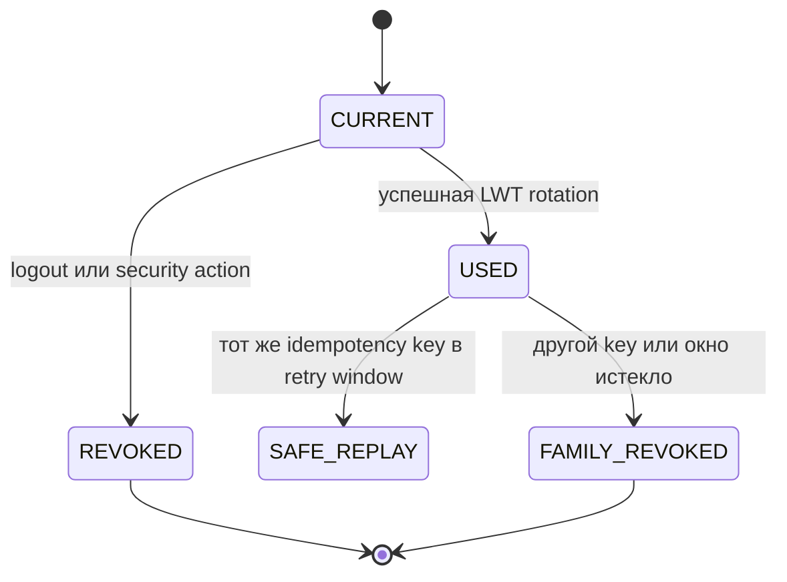

# 7. Identity Service: обязательная доработка и отдельный roadmap

## Главное решение

Identity Service уже содержит базовые use cases регистрации, входа, refresh rotation, logout и `/me`. Переписывать его перед MVP не нужно.

Но есть один **обязательный блокер Profile**:

> регистрация пользователя и `identity.user_registered.v1` должны фиксироваться атомарно через PostgreSQL transactional outbox.

Это milestone `M0`, подробно описанный в [главе 2](02-identity-outbox-and-profile.md). Cassandra-сессии, auth version и остальные улучшения ниже **не блокируют** Profile/Messages MVP.

## 7.1. Карта текущего и целевого состояния

| Область | Текущее подтверждённое состояние | Изменение | Когда |
|---|---|---|---|
| Credentials | PostgreSQL `users` | оставить source of truth | сейчас |
| Register/login/logout/me | реализованы | сохранить поведение и контракты | сейчас |
| Refresh sessions/tokens | PostgreSQL | позже вынести high-write path в Cassandra | post-MVP |
| Refresh retry/replay | PostgreSQL durable record + Valkey hot path | адаптировать к Cassandra session partition после прототипа | post-MVP |
| Registration event | отсутствует | outbox + relay + `identity.user_registered.v1` | **до Profile** |
| Access JWT | RS256 | расширить audiences; позже добавить session/auth version claims | интеграция / post-MVP |
| Gateway auth handoff | downstream ожидает Bearer | явно конвертировать trusted cookie в internal Bearer | до интеграции сервисов |
| Session management UI/API | нет | list devices, revoke one/all | post-MVP |

«Текущее» в таблице основано на исходниках `services/identity-service` на момент подготовки руководства. Перед выполнением roadmap повторно проверьте код и migrations.

## 7.2. Stage A — registration outbox

Выполните только этот Identity stage перед Profile:

1. добавить `OutboxMessage` в domain/application ports;
2. добавить PostgreSQL `outbox_messages` migration;
3. при успешном создании `User` добавить `identity.user_registered.v1` в том же Unit of Work;
4. не создавать event при duplicate/idempotent replay;
5. добавить отдельный relay entrypoint и DI;
6. добавить Kafka producer adapter;
7. добавить retry/lease/quarantine и метрики;
8. описать JSON Schema/AsyncAPI contract в root `contracts/`;
9. добавить consumer contract test в Profile;
10. доказать failure path: DB commit прошёл, Kafka была недоступна, затем relay доставил event.

Не публикуйте событие прямо из HTTP handler. Иначе:

- Kafka success + DB rollback создаст профиль без Identity user;
- DB commit + Kafka failure оставит пользователя без Profile;
- retry HTTP может создать дубликаты.

Gate: `G0` из главы 2 полностью зелёный. Только затем создавайте Profile consumer.

## 7.3. Stage B — интеграционный auth handoff

До подключения Profile/Messages/Storage/WS:

### Расширить JWT audience

Issuer должен выпускать token для явного списка доверенных consumers:

```text
andruha-api-gateway
andruha-user-profile-service
andruha-messages-dialogues-service
andruha-websocket-gateway-service
andruha-object-storage-service
```

Каждый consumer проверяет:

- signature;
- `iss`;
- собственный `aud`;
- `exp`, `nbf`, `iat` с малым clock skew;
- допустимый algorithm (`RS256`), без выбора алгоритма из недоверенного token header;
- обязательный `sub` UUID.

Не используйте один общий HS256 secret во всех сервисах. Public key verification позволяет consumers проверять, но не выпускать токены.

### Зафиксировать cookie-to-Bearer

Внешний browser получает HttpOnly cookie. Downstream endpoints используют `Authorization: Bearer`. Gateway должен:

1. удалить внешний `Authorization`;
2. извлечь `access_token` из доверенной cookie;
3. установить internal `Authorization: Bearer <token>`;
4. не логировать header/cookie;
5. не принимать одновременно неоднозначные источники credentials;
6. сохранить `X-Request-Id`.

Альтернатива — научить каждый сервис читать cookie, но она размазывает browser transport concern по сервисам. Для Andruha выбирается gateway mapping.

### WebSocket

WS Gateway проверяет access cookie при upgrade. Истёкший token после подключения:

- не делает соединение бессрочным;
- connection знает `exp`;
- до/при истечении сервер отправляет `auth.expiring` и закрывает согласованным application close code;
- клиент refresh-ит HTTP cookie и reconnect-ится.

## 7.4. Stage C — модель Cassandra для refresh sessions

Это учебная цель проекта, но не условие текстового MVP. Сначала зафиксируйте access patterns.

### Нужные запросы

| ID | Запрос |
|---|---|
| IA-01 | по `session_id` атомарно проверить активность и текущий refresh token |
| IA-02 | повернуть текущий token в новый и сохранить replay result |
| IA-03 | распознать повтор уже использованного token |
| IA-04 | отозвать session |
| IA-05 | отозвать все sessions пользователя |
| IA-06 | получить список sessions пользователя |
| IA-07 | удалить истёкшие данные TTL/cleanup |

Нельзя получить одновременно идеальные IA-01/02 и IA-05/06 одной таблицей. Нужны canonical session partition и отдельная user projection.

### Формат opaque token

Рекомендуемый формат:

```text
rt1.<base64url(session_id)>.<base64url(token_id)>.<base64url(32_random_bytes)>
```

- `session_id` и `token_id` — маршрутизация, не секрет;
- право даёт только 256-bit random secret;
- в storage сохраняется SHA-256/HMAC digest secret, не raw token;
- parser ограничивает общую длину, число частей и декодированный размер;
- сравнение digest constant-time;
- token никогда не логируется.

Если раскрытие идентификаторов неприемлемо, весь routing prefix можно AEAD-шифровать, но это усложняет rotation keys. Для учебного MVP UUID сами по себе не являются credential.

### Каноническая partition

Первая модель для прототипа:

```sql
CREATE TABLE identity_session_by_id (
    session_id uuid,
    row_kind text,
    token_id uuid,
    user_id uuid STATIC,
    status text STATIC,
    current_token_id uuid STATIC,
    idle_expires_at timestamp STATIC,
    absolute_expires_at timestamp STATIC,
    revoked_at timestamp STATIC,
    token_digest blob,
    token_state text,
    used_at timestamp,
    replay_ciphertext blob,
    replay_nonce blob,
    replay_key_id text,
    created_at timestamp,
    PRIMARY KEY ((session_id), row_kind, token_id)
);
```

Здесь все rows одной session имеют один partition key. Однако STATIC state + token history и conditional batch требуют обязательного spike: подтвердите на выбранной версии Cassandra, что нужная conditional mutation корректна, атомарна в одной partition и даёт приемлемую contention latency. Не принимайте эту схему только потому, что она красиво выглядит.

User projection:

```sql
CREATE TABLE identity_session_by_user_bucket (
    user_id uuid,
    bucket smallint,
    created_at timeuuid,
    session_id uuid,
    status text,
    last_seen_at timestamp,
    device_label text,
    PRIMARY KEY ((user_id, bucket), created_at, session_id)
) WITH CLUSTERING ORDER BY (created_at DESC);
```

`bucket` нужен для users с большим числом sessions и выбирается детерминированно. Projection может быть eventually consistent; security decision всегда читает canonical `session_id` partition.

### Rotation state machine



Успешная rotation должна логически совершить вместе:

- old token `CURRENT -> USED`;
- session `current_token_id -> new_token_id`;
- вставку digest нового token;
- сохранение зашифрованного replay result;
- новое `idle_expires_at`.

В PostgreSQL это одна transaction. В Cassandra сделайте небольшой executable spike с conditional batch в одной partition и failure injection. Если гарантии/latency не подходят, рассмотрите одну canonical row с bounded token history либо оставьте security-critical state в PostgreSQL. Учебная цель — принять решение по доказательствам, а не обязательно любой ценой мигрировать.

### Ambiguous timeout

LWT timeout не означает rollback. Клиент не знает, применена ли запись.

Алгоритм:

1. не выдавать новую случайную пару вслепую;
2. перечитать canonical session state с SERIAL semantics;
3. если new token/replay result зафиксирован — вернуть сохранённый результат;
4. если old всё ещё current — ограниченно повторить CAS;
5. если состояние противоречиво/недоступно — fail closed с retryable `503`;
6. метрика `identity_refresh_ambiguous_total`.

Этот тест обязателен до переключения трафика.

## 7.5. Stage D — Valkey остаётся ускорителем

Valkey может хранить:

- короткий distributed lease для concurrent refresh;
- encrypted replay cache;
- rate-limit counters;
- revoked/session hints с TTL.

Но durable ответ уже выполненной rotation должен восстанавливаться из canonical store. При потере Valkey допустимы рост latency/нагрузки или контролируемый fail-closed режим, но нельзя терять доказательство уже совершённой rotation.

Правило:

```text
PostgreSQL или Cassandra = correctness
Valkey = latency и contention reduction
```

## 7.6. Stage E — auth version и отзыв access token

Короткоживущий JWT stateless, поэтому logout обычно не отзывает уже выпущенный access token немедленно.

Варианты:

1. принять короткий TTL access token;
2. добавить `sid` и проверять revoked session online;
3. добавить user `auth_version`, включить в JWT и кешировать version;
4. вести denylist по `jti` до `exp`.

Для Andruha рекомендуемая последовательность:

- MVP: короткий access TTL + revoke refresh session;
- затем `sid` claim для чувствительных операций;
- `auth_version` для logout-all/password reset/account disable;
- Valkey cache с bounded TTL, durable version в Identity store;
- при недоступности проверки явно выбрать fail-open для обычного чтения или fail-closed для security-sensitive операций.

Не добавляйте online introspection каждому message send без измерений: это превратит Identity в глобальный bottleneck.

## 7.7. Stage F — управление устройствами и сессиями

Будущие endpoints:

```text
GET    /api/v1/identity/sessions
DELETE /api/v1/identity/sessions/{session_id}
DELETE /api/v1/identity/sessions          # revoke all except/current by policy
```

Модель ответа не раскрывает refresh token, digest, IP полностью или внутренний user agent без privacy review. Поля: session ID, created/last seen, coarse device label, current flag, revoked status.

Команды revoke обязаны быть идемпотентными. User projection может отставать; revoke выполняется по canonical session.

## 7.8. Stage G — регистрационная идемпотентность и события lifecycle

После MVP можно добавить `Idempotency-Key` к регистрации. Это отдельная семантика от уникального email:

- повтор того же request/key возвращает тот же user/result;
- тот же key + другое body даёт conflict;
- два разных key + один email дают один успех и `email_taken`/безопасный ответ согласно product policy;
- outbox event создаётся только для фактического первого user creation.

Будущие события:

- `identity.user_disabled.v1`;
- `identity.user_enabled.v1`;
- `identity.user_deleted.v1`;
- `identity.credentials_changed.v1` — только если у consumer есть обоснованный use case.

Не публикуйте password hash, refresh digest, email без необходимости. Profile для создания строки нужен `user_id`, а не credentials.

## 7.9. Миграция PostgreSQL sessions → Cassandra

Если production users отсутствуют, используйте greenfield cutover:

1. реализовать новый adapter за текущим application port;
2. прогнать contract suite обоих adapters;
3. развернуть Cassandra schema;
4. переключить локальное окружение;
5. инвалидировать старые локальные sessions;
6. удалить PostgreSQL session code только после стабилизации.

Если к моменту миграции существуют реальные sessions:

1. добавить dual-read с PostgreSQL fallback;
2. новые sessions писать в Cassandra;
3. безопасно мигрировать или естественно дождаться expiry старых;
4. метрикой доказать отсутствие PostgreSQL reads;
5. удалить fallback отдельным релизом.

Не делайте dual-write без reconciliation: partial failure создаст два расходящихся source of truth.

## 7.10. Тестовая матрица Identity roadmap

- два concurrent refresh одного token;
- safe retry с тем же key;
- повтор used token с другим key → revoke family;
- потерянный response и восстановление encrypted replay;
- Valkey down до/после canonical commit;
- Cassandra LWT timeout before/after apply;
- logout vs refresh race;
- logout-all vs login race;
- absolute expiry не продлевается;
- idle expiry продлевается только успешным refresh;
- compromised DB не содержит usable raw token;
- key rotation сохраняет decrypt старого replay до expiry;
- outbox relay redelivery не создаёт второй Profile;
- JWT consumer отклоняет чужой audience/issuer/algorithm;
- Gateway не пропускает внешний spoofed Authorization.

## 7.11. Stop conditions

Остановите migration/spike и пересмотрите дизайн, если:

- conditional mutation требует cross-partition atomicity;
- token history делает partition unbounded;
- ambiguous timeout нельзя однозначно восстановить;
- p99 LWT при целевой contention не укладывается в budget;
- Cassandra adapter заставляет domain/application импортировать driver types;
- Valkey становится единственным durable доказательством rotation;
- migration требует хранить или логировать raw token.

Правильный результат spike может быть: «PostgreSQL с partitioning/connection pooling пока безопаснее». Цель — изучить Cassandra и принять инженерное решение, а не искусственно заменить подходящую БД.

## 7.12. Gate `IM`

Identity roadmap считается завершённым только после отдельного решения и load/failure evidence. Для MVP достаточно:

- `G0`: registration outbox;
- `G0.5`: JWT audience + gateway auth handoff;
- сохранённой текущей refresh security;
- документированного, но не реализованного Cassandra roadmap.
