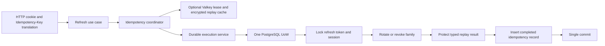

# Identity refresh idempotency architecture

**Status:** accepted for implementation  
**Inspected:** 2026-08-17  
**PayFlow revision:** `e431170e27448faae0907aba7dcb74bbbfa17957`  
**Identity revision:** `6c8a56935a149caa16e87d7d44c0bc9adc1813ac`

## Decision

Identity will preserve the current authentication behavior and replace Auth's
Redis-only HTTP guard with an Order-style application coordinator. PostgreSQL
is the correctness boundary and Valkey is an optional hot lease/cache. A
successful refresh rotation, a state-changing rejection, and its replayable
result are written in one SQLAlchemy unit of work.

The inspected code supports this boundary. PayFlow Auth already stages refresh
token consumption, session extension or revocation, and replacement-token
creation through repositories bound to one request-scoped `AsyncSession`.
Order's `DurableExecutionService` already executes a callback and inserts the
unique durable record through that same unit of work. Identity therefore needs
an adapted callback that does not open a nested unit of work.

No deviation invalidates the approved model. The target Identity revision is a
runnable HTTP skeleton with no database, authentication, DI, or idempotency
implementation, so all application behavior is additive. The migration spec
was untracked in the superproject at inspection time, and `docs/README.md`
already contained its link as a pre-existing worktree change.

## Inspected implementations

### Current PayFlow Auth

- `auth_service/src/app/entrypoints/http/routers/v1/auth.py` owns the
  `Idempotency-Key` header, hashes the refresh token into a JSON fingerprint,
  prefixes the raw client key, enters `IdempotencyGuard`, calls
  `AuthService.refresh`, and stores the returned `TokenPair`.
- `auth_service/src/app/application/services/idempotency/guard.py` is a
  transport-adjacent async context-manager FSM. It recognizes processing and
  completed Redis entries but has no durable fence or owner heartbeat.
- `auth_service/src/app/infrastructure/idempotency/redis_storage.py` uses Lua
  for acquire and compare-value release. Result completion is a separate
  best-effort Redis `SET`; it stores the serialized response and logs the
  storage key.
- `auth_service/src/app/application/services/auth_service.py` performs refresh
  rotation in its own UoW. The repositories lock the refresh token and session,
  consume the old token, extend or revoke the session, create the replacement,
  and commit before the HTTP guard writes its result.
- `auth_service/src/app/infrastructure/di/provider.py` keeps Redis and security
  adapters at `APP` scope; SQLAlchemy sessions, repositories, UoW, Auth service,
  and the guard factory are `REQUEST` scoped.
- `auth_service/src/app/entrypoints/http/routers/exception_handlers.py` maps
  conflict to 409, processing to 423 with `Retry-After`, and Redis safety-store
  failure to 503.

### Current PayFlow Order

- `order_service/src/app/application/idempotency/models.py`, `ports.py`, and
  `fingerprint.py` define transport-neutral identities, typed outcomes,
  canonical 32-byte SHA-256 fingerprints, hot-store and durable ports, owner
  token generation, and the sleeper seam.
- `order_service/src/app/application/idempotency/coordinator.py` obtains a
  random owner lease, maintains a heartbeat, checks the durable winner, and
  falls back to PostgreSQL when Redis is unavailable.
- `order_service/src/app/application/idempotency/durable_execution.py` executes
  the business callback and inserts the completed record inside one UoW. A
  unique-race loser rolls back staged changes and re-reads the winner.
- `order_service/src/app/infrastructure/idempotency/redis_hot_store.py` uses Lua
  for atomic begin, owner-token renewal, compare-and-set completion, and
  owner-token abandon. Its Redis key is derived from the scoped identity rather
  than containing the client key.
- `order_service/src/app/infrastructure/idempotency/circuit_breaker.py` wraps
  the optional hot store. Redis failures become the coordinator's durable
  fallback signal.
- `order_service/src/app/infrastructure/database/models/idempotency_records.py`
  and its repository persist a unique `(subject_id, operation, key_hash)`
  result, enforce digest and replay checks, and expose ordered bounded cleanup.
- Order DI keeps the Redis client, circuit breaker, and hot store at `APP`
  scope; the SQLAlchemy session, record repository, durable executor,
  coordinator, and use cases are `REQUEST` scoped.

## Comparison

| Dimension | Current PayFlow Auth | Current PayFlow Order | Required Identity direction |
|---|---|---|---|
| Identity scope | Raw client key is prefixed and included in a Redis key | `(subject_id, operation, SHA256(key))` | Constant public-refresh subject, `auth.refresh`, and a 32-byte key hash; no raw-key persistence |
| Request fingerprint | Sorted JSON to SHA-256 hex | Typed canonicalization to 32-byte SHA-256 | Reuse the Order fingerprint primitive over the supplied refresh-token digest |
| Processing ownership | Fixed TTL and serialized lock value; no unique renewable owner | Random owner token, heartbeat, CAS complete/abandon | Reuse the owner-token lease model |
| Durable fence | None | PostgreSQL `idempotency_records` unique identity | Identity PostgreSQL in this phase |
| Business atomicity | Rotation commits before best-effort Redis result storage | Effect and result commit in one UoW | Rotation/revocation and durable replay result commit together |
| Redis/Valkey outage | Acquire failure rejects refresh | Coordinator falls back to durable execution | Valkey is optional and PostgreSQL remains correct |
| Completed replay | Plain serialized `TokenPair` in Redis | Typed payload or resource reference | AES-256-GCM envelope plus a refresh-token resource reference |
| Concurrent duplicate | Processing until fixed TTL | Hot lease plus durable unique arbitration | Hot lease when available and durable winner arbitration always |
| Lease expiry | A worker may outlive the lock | Heartbeat and owner-token fencing | A stale owner cannot renew, complete, or abandon a replacement lease |
| Retention | Redis TTL only | Durable expiry and bounded deletion | Five-minute durable replay window and bounded cleanup port |
| Readiness | PostgreSQL and Redis are both correctness dependencies | PostgreSQL critical; Redis optional | PostgreSQL failure returns 503; Valkey failure is degraded but ready |
| Logging | Raw scoped key and storage key can reach logs | Outcome and safe dependency metadata | No key, digest, token, nonce, ciphertext, PII, or identifier labels |

## Confirmed Auth crash window

The current boundary has an ambiguous committed result:

1. `AuthService.refresh` commits rotation in PostgreSQL.
2. The process crashes, the response is lost, or the later Redis result write
   fails before a recoverable result exists.
3. The client retries the same refresh token and `Idempotency-Key`.
4. When the fixed Redis processing entry is absent or expires, Auth invokes
   rotation again.
5. The already consumed token is classified as reuse, so a legitimate network
   retry can revoke the session family.

Best-effort result caching cannot close this window. Only co-committing the
business state and durable result does.

## Identity transaction boundary

The refresh use case builds the identity and request hash, then passes a
transaction callback to the coordinator. The callback receives request-scoped
repositories and performs no nested UoW or network I/O. AES-GCM is local CPU
work and is safe inside the transaction. A commit failure yields neither new
cookies nor committed business/idempotency state.

## Adaptation boundary

Reusable components are the scoped identity and outcome models, canonical
fingerprinting, hot-store and durable ports, owner-token factory, sleeper seam,
coordinator and heartbeat behavior, circuit-breaker wrapper, Lua lease/CAS
semantics, durable unique-winner algorithm, record repository shape, and
bounded expiration cleanup.

Identity-specific adaptations are the constant unauthenticated subject, the
`auth.refresh` operation, the semantic token-digest fingerprint, typed terminal
authentication results, the replay protector port, AES-GCM envelope, refresh
token resource freshness check, Identity error mapping, metrics, namespace,
and the generic database resource constraint.

The migration excludes `processed_messages`, Inbox logic, Order aggregates,
order history and transitions, outbox code, pricing preparation, Order metrics,
and the database constraint that couples `result_type='order'` to
`resource_type='order'`.

## Hexagonal package placement

Identity organizes the implementation by architectural responsibility rather
than by an `idempotency/` feature package:

| Responsibility | Target package |
|---|---|
| Immutable operation identity and outcome vocabulary | `application/value_objects/idempotency.py` |
| Data crossing application ports | `application/ports/dto/idempotency.py` |
| Hot-store, durable-execution, observer, replay-protector, and repository contracts | `application/ports/idempotency.py` |
| Coordination, durable execution, and canonical fingerprinting | `application/services/` |
| Application-level idempotency failures | `application/exceptions/idempotency.py` |
| Valkey implementation of the hot-store port | `infrastructure/cache/valkey_idempotency_store.py` |
| Circuit-breaking hot-store decorator | `infrastructure/resilience/circuit_breaking_hot_store.py` |
| Durable record adapter and ORM mapping | Existing `infrastructure/database/repositories/` and `infrastructure/database/models/` packages |
| Low-cardinality observer adapter | Existing `infrastructure/observability/` package |

Application code imports only application contracts, DTOs, value objects, and
services. Infrastructure implements those ports and is selected only in the DI
composition root. No `application/idempotency/` or
`infrastructure/idempotency/` package is part of the target layout.

## Threat review

| Threat | Required control and failure behavior |
|---|---|
| Replay storage disclosure | Persist only a versioned AES-256-GCM envelope and generic resource reference. Raw access/refresh tokens and plaintext pairs never enter PostgreSQL or Valkey. |
| Cross-user or cross-request collision | Scope identity by constant public-refresh subject plus operation and SHA-256 key hash; bind identity, request hash, result discriminator, and versions into AEAD AAD. A moved envelope fails authentication. |
| Same key with another token | The semantic request hash differs, so hot and durable paths return conflict without rotating or revoking the second payload. |
| Lease loss or worker pause | Heartbeat renews only the matching random owner. CAS completion and abandon reject stale owners. PostgreSQL remains authoritative even if the hot lease is lost. |
| Stale successful replay | Before decrypting cookies into a response, verify the referenced replacement refresh-token row is present, unused, and belongs to an active session. Otherwise clear cookies and return a safe authentication failure. |
| Missing or retired encryption key | Load active and decrypt-only keys from mounted files during startup. Missing active material fails startup; an unavailable replay key fails closed with 503 and does not rotate. Previous keys remain mounted longer than replay retention. |
| Corrupted Valkey state | Strict state/format/result validation converts corruption to hot-store unavailability, opens/fails the circuit, and falls back to PostgreSQL. Corrupted durable ciphertext fails closed with the replay-unavailable error. |
| PostgreSQL race | The unique identity is the durable fence. A losing transaction rolls back all staged session/token changes, then re-reads and classifies the committed winner as replay or conflict. |
| Arbitrary invalid-token flood | Pure failures before a known token family do not insert durable records. Only successful rotation or a state-changing terminal rejection is replayable. |
| Sensitive telemetry | Logs and metrics expose only low-cardinality operation, outcome, dependency, and safe exception type. They exclude email, cookies, headers, keys, hashes, token/session IDs, ciphertext, nonce, and key IDs where unnecessary. |

## Consequences

- The HTTP layer no longer owns an async idempotency guard.
- The DI graph exposes one guarded refresh use case; there is no public
  unguarded refresh service method.
- PostgreSQL is readiness-critical; Valkey is observable as degraded but does
  not gate correct refresh execution.
- The five-minute result contains recoverable credentials, so encryption-key
  availability and freshness validation are correctness requirements.
- The later Cassandra session design replaces the durable adapter. It does not
  change the current HTTP contract and is not implemented here.
