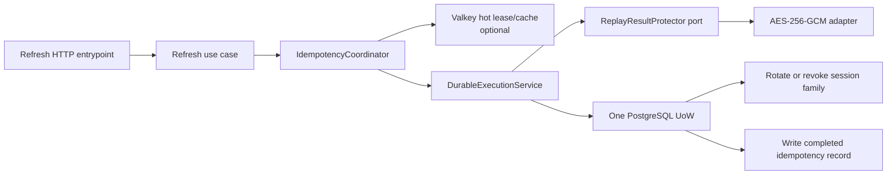

# Andruha Identity Service - PayFlow Auth Migration

**Document type:** Agent Implementation Specification

**Status:** Ready for review

**Audience:** implementation agent

**Version:** 1.0

**Date:** 2026-08-17

> **Scope boundary:** migrate the current PayFlow Auth behavior and replace its Redis-only HTTP idempotency with an Order-style durable coordinator. The future Cassandra session architecture, registration outbox, extra JWT claims, CSRF policy, rate limiting, and other roadmap items are context only and MUST NOT be implemented in this task.

## 1. Objective

Turn the existing `andruha-identity-service` skeleton into a runnable Identity Service by adapting the current PayFlow `auth_service`, while preserving the already implemented Andruha bootstrap, CI, logging, request-ID middleware, repository boundaries, and port `8001`.

The migrated service must provide registration, login, refresh, logout, and current-identity behavior. Refresh retries must use the architectural pattern implemented in PayFlow Order Service:

- PostgreSQL is the durable idempotency fence and replay source;
- Valkey is an optional hot lease/cache;
- the business effect and durable idempotency result commit in one local transaction;
- Valkey failure falls back to PostgreSQL;
- raw idempotency keys and token pairs are never stored or logged in plaintext.

## 2. Mandatory execution order

The agent MUST perform the work in this order:

1. Inspect the exact source and target revisions listed below.
2. Produce the architecture comparison required by `ANA-*` before editing Identity application code.
3. Record any deviation between the inspected code and this specification.
4. Implement the migration in small verified stages.
5. Run the complete verification plan and report failures honestly.

The architecture report is a real gate, not a ceremonial summary. If the inspected implementations invalidate the approved transaction or security model, stop before implementation and request an owner decision.

## 3. Repositories and source snapshots

### Read-only source

- Repository: `C:\Projects\PayFlow`
- Inspected revision: `e431170e27448faae0907aba7dcb74bbbfa17957`
- `auth_service/` is the source of authentication behavior.
- `order_service/` is the source of the target idempotency architecture.
- `.agents/AGENTS.md` is the PayFlow architecture and engineering guide.

The agent MUST treat PayFlow as read-only. It MUST NOT fix, format, commit, or otherwise modify PayFlow while performing this migration.

### Implementation target

- Superproject: `C:\Projects\Andruha`
- Service repository: `C:\Projects\Andruha\services\identity-service`
- Inspected Identity revision: `6c8a56935a149caa16e87d7d44c0bc9adc1813ac`
- Remote: `https://github.com/yemeal/andruha-identity-service.git`

The target service already has runnable bootstrap code, locked dependencies, tests, CI/release workflows, a multi-stage Dockerfile, and project-specific logging/request-ID infrastructure. These files are target state to extend, not disposable placeholders.

### Canonical project documents

- `C:\Projects\Andruha\docs\project-overview.md`
- `C:\Projects\Andruha\docs\mvp-sequence-diagrams.md`
- `C:\Projects\Andruha\docs\service-skeleton-agent-spec.md`
- `C:\Projects\Andruha\contracts\README.md`

## 4. Verified implementation evidence

### PayFlow Auth sources

- `auth_service/src/app/application/services/auth_service.py`
- `auth_service/src/app/application/services/idempotency/`
- `auth_service/src/app/application/exceptions/idempotency.py`
- `auth_service/src/app/application/utils/compute_payload_hash.py`
- `auth_service/src/app/infrastructure/idempotency/redis_storage.py`
- `auth_service/src/app/infrastructure/database/`
- `auth_service/src/app/infrastructure/security/`
- `auth_service/src/app/infrastructure/di/provider.py`
- `auth_service/src/app/entrypoints/http/routers/v1/auth.py`
- `auth_service/src/app/entrypoints/http/routers/exception_handlers.py`
- `auth_service/src/app/entrypoints/http/main.py`
- `auth_service/src/tests/`
- `auth_service/alembic/versions/`

### PayFlow Order idempotency sources

- `order_service/src/app/application/idempotency/models.py`
- `order_service/src/app/application/idempotency/ports.py`
- `order_service/src/app/application/idempotency/fingerprint.py`
- `order_service/src/app/application/idempotency/coordinator.py`
- `order_service/src/app/application/idempotency/durable_execution.py`
- `order_service/src/app/infrastructure/idempotency/redis_hot_store.py`
- `order_service/src/app/infrastructure/idempotency/circuit_breaker.py`
- `order_service/src/app/infrastructure/database/models/idempotency_records.py`
- `order_service/src/app/infrastructure/database/repositories/idempotency_record_repository.py`
- `order_service/src/app/entrypoints/http/mappers.py`
- `order_service/src/tests/test_idempotency_*.py`
- `order_service/src/tests/test_durable_idempotency_execution.py`
- `order_service/src/tests/test_redis_hot_idempotency_store.py`
- `order_service/src/tests/test_stage3_idempotency_resilience_contract.py`

Source tests were not revalidated while drafting this specification. Both PayFlow virtual environments reference a missing base executable at `C:\Users\Alex\AppData\Local\Programs\Python\Python314\python.exe`. The live attempt failed before pytest started. Historical pass counts MUST NOT be reported as current baseline evidence.

## 5. Required architecture analysis

Create `C:\Projects\Andruha\docs\identity-idempotency-architecture.md` before application-code changes. Add it to `docs/README.md`.

### ANA-001 - Current-state reconstruction

The report MUST reconstruct both implementations from current code, including object responsibilities, layer placement, DI scopes, transaction boundaries, stored data, Redis scripts, failure behavior, and public error mapping.

### ANA-002 - Comparison matrix

The report MUST compare at least these dimensions:

| Dimension | Current PayFlow Auth | Current PayFlow Order | Required Identity direction |
|---|---|---|---|
| Identity scope | Prefixed raw client key in Redis | `(subject_id, operation, SHA256(key))` | Transport-neutral scoped identity; no raw key storage |
| Request fingerprint | JSON -> SHA-256 hex string | Typed canonicalization -> 32-byte SHA-256 | Reuse Order fingerprint primitive |
| Processing ownership | Fixed TTL, no unique owner heartbeat | Random owner token, renewable lease, CAS complete/abandon | Reuse Order ownership model |
| Durable fence | None | PostgreSQL `idempotency_records` | Identity PostgreSQL in this phase |
| Business atomicity | Rotation commits before best-effort result cache | Effect and result commit in one UoW | Atomic rotation/revocation plus replay result |
| Redis/Valkey outage | Request fails before rotation | Falls back to durable execution | Valkey is optional hot path |
| Completed replay | Plain `TokenPair` JSON in Redis | Typed stored result; resource-reference option | Encrypted token pair plus refresh-token resource reference |
| Concurrent duplicate | `PROCESSING` until fixed TTL | Hot lease plus durable arbitration | Hot lease plus durable arbitration |
| Lease expiry | Old worker can outlive lock TTL | Heartbeat and owner-token fencing | Old owner cannot complete another owner's lease |
| Retention | Redis TTL only | Durable expiry plus bounded cleanup | Five-minute replay window plus bounded cleanup support |
| Readiness | PostgreSQL and Redis are both critical | PostgreSQL critical; Redis degraded | PostgreSQL critical; Valkey degraded |
| Logging | Raw scoped idempotency key can reach logs | Hashes/low-cardinality outcomes | No raw keys, tokens, digests, ciphertext, or PII |

### ANA-003 - Defect statement

The report MUST explicitly explain the current Auth crash window:

1. refresh rotation commits in PostgreSQL;
2. the process crashes or the Redis result write fails before a recoverable result is stored;
3. the client retries the same token and key;
4. after the Redis lease expires, Auth can execute rotation again;
5. the old token now looks reused, so a legitimate retry can revoke the family.

### ANA-004 - Adaptation decision

The report MUST distinguish reusable Order components from Order-specific code. It MUST NOT copy `processed_messages`, Inbox logic, Order aggregates, outbox code, pricing code, Order metrics, or the Order-only `resource_type='order'` database constraint.

### ANA-005 - Security review

The report MUST include a threat-focused review of replay-result storage, cross-user key collisions, lease loss, stale replay after another refresh, missing encryption keys, corrupted Redis state, database races, and sensitive logging.

## 6. Approved architecture decision

### Decision

Adopt the Order Service idempotency coordinator as an architectural pattern, adapted to Identity's refresh secret lifecycle.



### Consequences

- The HTTP entrypoint no longer owns an async context-manager guard.
- A dedicated refresh use case owns idempotency orchestration.
- The transactional refresh operation MUST NOT open a nested UoW.
- PostgreSQL remains the session and durable-idempotency store in this migration.
- Valkey improves latency and duplicate suppression but is not required for correctness.
- Successful token pairs require encrypted, short-lived durable replay material.
- The later move to Cassandra requires replacing the durable adapter, not changing the HTTP contract.

### Rejected alternatives

- Keeping Auth's Redis-only guard: rejected because it has no durable recovery after rotation commit.
- Copying Order code without adaptation: rejected because Order's serialized/resource replay policy does not protect bearer tokens.
- Persisting raw access or refresh tokens in PostgreSQL or Valkey: rejected as a credential disclosure risk.
- Writing the idempotency result after the rotation transaction: rejected because it recreates the ambiguous-result window.

## 7. In-scope repositories and changes

### Identity repository

The agent MAY modify the Identity service source, tests, dependency metadata, lock file, Alembic setup, Dockerfile, entrypoint, environment template, README, and CI workflows where required by the migrated behavior.

### Superproject

The agent MAY modify only these integration surfaces:

- `docker-compose.yml` and `.env.example` for Identity PostgreSQL, Valkey, key files, port `8001`, and health wiring;
- `services/api-gateway/nginx.conf` only if required to preserve the development-only token endpoint boundary;
- `docs/README.md`, `docs/project-overview.md`, and the two Identity migration documents;
- `contracts/README.md` only to record the implemented Identity HTTP contract location or generation command.

The agent MUST NOT modify User Profile, Messages and Dialogues, WebSocket Gateway, or Object Storage service repositories.

No commits, pushes, releases, remote repository changes, or production mutations are authorized.

## 8. Migration requirements

### MIG-001 - Preserve target bootstrap

The agent MUST merge Auth behavior into the current Identity skeleton. It MUST preserve the current factory-style `create_app`, port `8001`, request-ID middleware behavior, logging contract, root-level `tests/` layout, CI/release workflows, and modern dependency baseline unless a verified incompatibility requires a documented change.

### MIG-002 - Remove PayFlow identity

The migrated code, settings, OpenAPI metadata, logs, container configuration, and documentation MUST contain no PayFlow/OrderFlow product names, service audiences, ports, database names, Redis namespaces, author email, or secret paths.

### MIG-003 - Preserve Auth capabilities

The service MUST implement the current PayFlow behaviors for:

- `POST /api/v1/auth/register`;
- `POST /api/v1/auth/login`;
- `POST /api/v1/auth/refresh`;
- `POST /api/v1/auth/logout`;
- `GET /api/v1/auth/me`;
- the explicitly development-only test token endpoint.

The agent MUST preserve cookie-only browser transport, safe error mapping, `Cache-Control: no-store`, normalized email, Argon2id hashing, constant-work login verification, short database transactions, RS256 access tokens, opaque refresh tokens, token-family reuse detection, and idempotent logout.

### MIG-004 - Keep application boundaries clean

Domain code MUST remain independent of FastAPI, SQLAlchemy, Redis/Valkey, cryptography adapters, and HTTP headers. `Idempotency-Key`, cookies, status codes, and `Retry-After` MUST be translated at the HTTP boundary into application commands/results.

### MIG-005 - No unguarded refresh path

The DI container MUST expose one application refresh use case that requires an idempotency request. The HTTP router MUST NOT call a public unguarded `AuthService.refresh(refresh_token)` method. Business rotation logic MUST execute only as the durable coordinator's transaction callback.

### MIG-006 - Greenfield migration history

The agent MUST NOT copy PayFlow's five historical Alembic revisions. Andruha has no deployed Identity dataset. Create one greenfield baseline migration matching the final ORM schema.

### MIG-007 - Test migration

Adapt relevant PayFlow Auth tests into the target root-level `tests/unit` and `tests/integration` structure. Preserve existing target bootstrap tests. Do not weaken, delete, or mark tests as skipped merely to make the migration pass.

## 9. Idempotency requirements

### IDEM-001 - Scoped identity

For the unauthenticated refresh boundary, preserve the existing same-key/different-token conflict semantics:

- `subject_id` is a documented constant namespace for public refresh requests;
- `operation` is a stable application name such as `auth.refresh`;
- `key_hash` is the 32-byte SHA-256 of the normalized `Idempotency-Key`;
- `request_hash` is computed from a semantic payload containing only the SHA-256 digest of the supplied refresh token.

The raw key, raw token, and token digest MUST NOT be used as a Redis key, PostgreSQL identity column, metric label, or log field.

### IDEM-002 - Generic application core

Adapt Order's transport-neutral models, ports, fingerprinting, coordinator, outcomes, owner-token factory, sleeper seam, and durable execution service into `src/app/application/idempotency/`. Do not retain Order-specific names or conditions.

### IDEM-003 - Valkey hot store

The Valkey adapter MUST preserve Order's atomic begin/replay/conflict/in-progress decisions, random owner token, renewable lease, owner-token compare-and-set completion, owner-token abandon, format version, namespace version, corruption detection, and circuit breaker.

### IDEM-004 - Durable execution

PostgreSQL MUST atomically commit each state-changing refresh outcome and its completed idempotency record in the same SQLAlchemy UoW. A commit failure MUST return no new cookies and leave no committed rotation result.

### IDEM-005 - Durable fallback

If Valkey is unavailable or its circuit breaker is open, the coordinator MUST execute through PostgreSQL. A healthy PostgreSQL path MUST still support executed, replay, conflict, and concurrent-winner outcomes without relying on Valkey.

### IDEM-006 - Ambiguous-result recovery

If rotation and the durable result committed but the response or Valkey completion was lost, the same token and same idempotency key MUST return the exact same token pair without invoking rotation again.

### IDEM-007 - State-changing rejection

If reuse detection or user-state validation revokes a session family, the revocation and a safe replayable rejection result MUST commit atomically. The application callback MUST return a typed terminal result instead of raising an exception that would roll back the revocation.

Pure validation failures that do not mutate durable state MUST NOT create unbounded durable idempotency records for arbitrary attacker input.

### IDEM-008 - Concurrent winner

When two requests race without a usable Valkey lease, the losing transaction MUST roll back all staged refresh/session changes, re-read the committed winner, and return replay or conflict. It MUST NOT surface an unrelated stale-state error.

### IDEM-009 - Replay freshness

A successful replay record MUST contain a generic resource reference to the newly created refresh-token record. Before returning decrypted cookies, the use case MUST verify that the referenced token still exists, is unused, and belongs to an active session.

If the session was revoked or the referenced token was consumed by a later rotation, the service MUST NOT return the stale token pair. It must return a safe authentication failure and clear authentication cookies.

### IDEM-010 - Retention

The durable replay window MUST default to the current Auth value of 300 seconds. The table MUST include `expires_at` and an ordered index. The repository MUST expose a bounded, threshold-based deletion operation. Automatic production scheduling is outside this task unless an existing Andruha worker convention is discovered and documented.

### IDEM-011 - HTTP outcomes

- same key plus same token and completed active result -> `204` with the same cookies;
- same key plus different token -> `409 auth.idempotency_key_conflict`;
- same key while no durable winner exists and another owner is processing -> `423` with `Retry-After`;
- Valkey unavailable with PostgreSQL healthy -> normal durable execution, not `503`;
- PostgreSQL unavailable before a proven result -> `503` with no rotation;
- corrupted or undecryptable completed result -> fail closed with `503 auth.refresh_replay_unavailable`, without rotation or secret disclosure;
- same token with another key after consumption -> normal reuse detection and family revocation.

## 10. Secret replay-result requirements

### SEC-001 - No plaintext token persistence

Raw access tokens, raw refresh tokens, and a plaintext `TokenPair` MUST NOT appear in PostgreSQL, Valkey, logs, metrics, traces, exception strings, test snapshots, or committed fixtures.

### SEC-002 - Replay protector port

Define an application port that protects and restores a typed refresh result. Implement it with an infrastructure adapter using AES-256-GCM with a fresh 96-bit nonce for every stored result.

### SEC-003 - Authenticated encryption context

AEAD additional authenticated data MUST bind at least the record format version, `subject_id`, operation, `key_hash`, `request_hash`, result type, and result version. Moving ciphertext to another idempotency identity must make decryption fail.

### SEC-004 - Key management

The active encryption key and decrypt-only previous keys MUST be loaded from mounted secret files through a key ring. Configuration may contain key IDs and paths, never key bytes. The active key ID MUST be persisted in the encrypted envelope. An old key MUST remain available for at least the maximum durable replay retention window after rotation.

### SEC-005 - Stored envelope

The stored success payload may contain only a versioned envelope such as key ID, algorithm/version, nonce, and ciphertext. It MUST also contain the generic refresh-token resource reference required by `IDEM-009`. Order-specific resource constraints MUST be removed from the Identity schema.

### SEC-006 - Logging and errors

Logs may contain operation, outcome, request ID, storage dependency, and safe exception type. Logs MUST NOT contain email, cookies, authorization headers, idempotency keys, key hashes, request hashes, refresh digests, token IDs when avoidable, ciphertext, encryption nonces, or key material.

## 11. Data model

The greenfield PostgreSQL baseline MUST include:

1. `users` matching the final PayFlow model: UUIDv7 ID, normalized unique email, password hash, role, status, and timezone-aware timestamps.
2. `auth_sessions`: user reference, idle expiry, revoked timestamp, creation timestamp, checks, and cleanup-oriented indexes.
3. `refresh_tokens`: session reference, unique 32-byte token digest, used timestamp, creation timestamp, checks, and lookup indexes.
4. `idempotency_records` adapted from Order Service.

The Identity `idempotency_records` table MUST contain:

- UUIDv7 primary key;
- `subject_id`, `operation`, `key_hash` and a unique constraint over that tuple;
- 32-byte `request_hash`;
- positive fingerprint/result format versions;
- typed result discriminator and JSONB replay payload;
- optional generic `resource_type`, `resource_id`, and `resource_version` fields;
- timezone-aware `created_at`, `completed_at`, and `expires_at`;
- consistency checks for digest lengths, resource field pairing, completion time, expiration, and replayability;
- an index supporting bounded expiration cleanup.

The baseline MUST NOT contain PayFlow data transforms, backfills, Order-only constraints, Cassandra tables, outbox tables, or deployed-data compatibility code.

## 12. Configuration and deployment

### OPS-001 - Service identity

Use `andruha-identity-service`, port `8001`, the Andruha PostgreSQL service name, and an Identity-specific Valkey namespace. JWT issuer and audiences MUST use Andruha service names only.

### OPS-002 - Dependency merge

Merge required Auth dependencies into the target `pyproject.toml` without downgrading newer compatible target dependencies merely to match PayFlow. Regenerate `poetry.lock`; do not copy PayFlow's lock file. Directly declare every library imported by Identity, including cryptographic, database, DI, settings, metrics, and Valkey clients.

### OPS-003 - Compose wiring

Update the root Compose service with Identity database, Valkey, migration, JWT key-file, and replay-encryption key-file settings. Identity MUST depend on healthy PostgreSQL. It MUST NOT require Valkey, Kafka, or Identity Cassandra to become ready in this phase.

### OPS-004 - Health semantics

- `/health/live` reports process liveness without dependency calls.
- `/health/ready` returns `503` when PostgreSQL is unavailable.
- `/health/ready` reports Valkey as degraded but remains `200` when PostgreSQL is healthy.
- Cassandra and Kafka MUST NOT appear in the current readiness decision.

### OPS-005 - Startup and keys

Startup MUST fail before serving traffic when required JWT or replay-encryption key configuration is invalid. Development key-generation instructions must create ignored local files. No real or generated private key may be committed.

### OPS-006 - Development-only token endpoint

Retain the PayFlow test token endpoint for local integration testing. It MUST be absent outside explicitly permitted local/test environments and blocked by an exact API Gateway location. A broad environment flag that accidentally exposes it in production MUST fail startup.

### OPS-007 - Observability

Preserve structured JSON production logs, readable development logs, request-ID correlation, `/metrics`, and low-cardinality labels. Add idempotency outcomes and hot-store degraded/fallback observations without subject IDs, token IDs, request IDs, keys, digests, or error messages as metric labels.

## 13. Public compatibility

- Preserve current endpoint paths and cookie names unless a verified Andruha contract already differs.
- Preserve access cookie path `/` and refresh cookie path `/api/v1/auth`.
- Preserve `HttpOnly`, configurable `Secure`, configured `SameSite`, and no-store response headers.
- Preserve the fixed RS256 algorithm, trusted local key ring selected by `kid`, issuer/audience checks, expiration, token type, and minimal role claim.
- Do not add profile fields to `/me`; it exposes credential-side identity only.
- Do not make API Gateway validate JWT or query sessions.
- Do not add synchronous Identity calls to other services.

## 14. Future target - document only, do not implement

The following decisions provide development context. They are explicitly outside this migration. No dependency, adapter, schema, event handler, Compose dependency, or partial implementation for them may be added now.

The roadmap is tied to the already documented Identity tasks as follows:

| Existing task | Implement in this migration | Planned later change |
|---|---|---|
| `AUTH-01` registration | Register credentials in Identity PostgreSQL | Atomically write `identity.user_registered.v1` to an outbox; asynchronously provision the default profile |
| `AUTH-02` login | Validate credentials and create the current PostgreSQL session family | Move the session family to Cassandra; add reviewed session/version claims and capacity controls |
| `AUTH-03` refresh | Use PostgreSQL durable idempotency plus optional Valkey, as specified here | Move the durable rotation/LWT/recoverable result into one Cassandra session partition; evolve the opaque token format |
| `AUTH-04` logout | Revoke the PostgreSQL session idempotently | Revoke the Cassandra session family with LWT and preserve non-disclosure semantics |
| `AUTH-05` current identity | Verify RS256 and read credential-side identity from PostgreSQL | Keep profile fields outside Identity; review authorization-version propagation separately |
| Cross-cutting hardening | Preserve current safe defaults and tests | Finalize CSRF/CORS, abuse controls, session management, retention, cleanup, key distribution, and operational capacity |

The agent MUST use this table to understand the intended evolution, not as authorization to implement the rightmost column.

### FUT-001 - Cassandra session store

Move `auth_sessions` and refresh-token family state from PostgreSQL to a dedicated Identity Cassandra cluster. Partition by session family so login, refresh rotation, reuse detection, logout, and recoverable replay state operate within one bounded partition. Use Cassandra LWT for compare-and-set rotation and revocation. Add an absolute session lifetime in addition to sliding idle expiry.

### FUT-002 - Self-routing opaque refresh format

Evolve the opaque token format so Identity can extract non-secret session/token identifiers and digest only the secret portion. The token must remain unforgeable and must not expose a reusable secret. The exact wire format requires a separate reviewed design.

### FUT-003 - Cassandra durable idempotency adapter

When sessions move to Cassandra, replace PostgreSQL durable refresh execution with a Cassandra adapter that co-locates encrypted recoverable rotation output in the session partition. Valkey remains an optional hot path. The HTTP idempotency contract and application coordinator remain stable.

This future direction supersedes the current `AUTH-03` diagram branch that treats Valkey outage as an unconditional `503`: once the durable Cassandra path exists, Valkey loss should fall back to that durable path.

### FUT-004 - Registration outbox and profile provisioning

Add an Identity PostgreSQL transactional outbox. Registration will atomically store the user and `identity.user_registered.v1`; a separate relay will publish it to Kafka, and User Profile Service will create a default profile idempotently. Kafka/Profile failure must delay profile creation without rolling back registration.

### FUT-005 - JWT session/version claims

Evaluate adding `sid` and `auth_version` to access tokens. Define how downstream services learn the current authorization version before treating it as revocation control. Do not add claims that consumers cannot validate semantically. Public-key distribution or JWKS remains a separate decision.

### FUT-006 - Login capacity and abuse protection

Add measured Argon2 worker limits, overload behavior, endpoint rate limiting, brute-force controls, and safe retry responses. Preserve constant-work verification and never reveal whether an email exists.

### FUT-007 - Browser security contract

Before public Internet exposure, define exact trusted origins, credentialed CORS, CSRF protection for cookie-authenticated unsafe methods, Fetch Metadata policy, cookie domain/path strategy, and TLS-only production defaults.

### FUT-008 - Session management and cleanup

Add user-facing session listing/revocation, Cassandra TTL/retention policy, bounded cleanup/reconciliation, and operational metrics. Used refresh tokens must remain long enough to support replay detection for the session family.

### FUT-009 - Registration idempotency

Registration currently resolves an ambiguous retry through the unique email constraint and subsequent login. A dedicated registration `Idempotency-Key` is post-MVP hardening and is not part of this migration.

## 15. Explicit non-goals

The agent MUST NOT:

- implement any `FUT-*` item;
- connect Identity application code to Cassandra or Kafka;
- create the registration outbox or event contracts;
- change User Profile or any messaging service;
- introduce a shared Python package between repositories;
- copy PayFlow's migration history or user data;
- add legacy compatibility, dual writes, backfills, or feature flags for a deployed population;
- store secrets in source control or Docker environment values;
- replace working Andruha CI/bootstrap code wholesale;
- claim Exactly Once, production HA, or completed high-RPS scaling.

## 16. Failure and edge-case matrix

| Scenario | Required outcome |
|---|---|
| Same key, same token, first request succeeds | One rotation; exact pair returned |
| Response lost after PostgreSQL commit | Same request replays exact encrypted result |
| Valkey completion fails after commit | Response may succeed; later retry replays from PostgreSQL |
| Valkey unavailable before begin | PostgreSQL durable path executes safely |
| Same key, different token | `409`; no rotation/revocation for the second payload |
| Concurrent same request, hot lease active | `423` unless durable winner already exists |
| Concurrent same request, Valkey unavailable | One committed winner; loser replays or conflicts |
| Hot lease expires while owner runs | Heartbeat renews; stale owner cannot complete replacement lease |
| Different key reuses consumed token | Family revoked; safe `401` |
| Rejection requires revocation | Revocation and terminal replay result commit together |
| PostgreSQL commit fails | No cookies and no durable business/idempotency effect |
| Replay encryption key missing | Safe `503`; no rotation; no ciphertext details |
| Replay target token already used/revoked | No stale cookie replay; safe auth failure |
| Unknown/malformed token flood | No unbounded durable result creation |
| Idempotency record expired | Normal reuse policy applies after bounded cleanup |

## 17. Acceptance criteria and traceability

| ID | Requirements | Observable acceptance | Evidence |
|---|---|---|---|
| AC-01 | ANA-001..005 | Architecture report exists, cites current files, contains the comparison, defect, transaction diagram, security analysis, and adaptation decision | Document review |
| AC-02 | MIG-001..003 | Identity exposes all migrated Auth endpoints on port `8001`; no PayFlow identity remains | HTTP/OpenAPI tests plus repository search |
| AC-03 | MIG-004..005 | HTTP transport maps into a transport-neutral refresh use case; no unguarded DI refresh path exists | Architecture/import test and source inspection |
| AC-04 | MIG-006, data model | One baseline migration creates the final four-table schema on an empty PostgreSQL database | Alembic integration test and metadata comparison |
| AC-05 | IDEM-001..005 | Order-style coordinator, owner lease, durable execution, circuit breaker, and PostgreSQL fallback are present without Order-specific code | Unit and adapter contract tests |
| AC-06 | IDEM-006..008 | Lost response, failed hot completion, Redis-down concurrency, and state-changing rejection are recovered without duplicate committed effects | PostgreSQL integration tests |
| AC-07 | IDEM-009 | Replay validates the referenced refresh token/session and rejects stale/revoked results | Application and integration tests |
| AC-08 | IDEM-010..011 | TTL, bounded cleanup, 204/409/423/503 behavior, and `Retry-After` match the specification | Repository, HTTP, and integration tests |
| AC-09 | SEC-001..006 | Database, Valkey, captured logs, metrics, and errors contain no plaintext token pair or raw idempotency material | Automated canary-secret scan in tests |
| AC-10 | OPS-001..004 | Compose uses port `8001`; PostgreSQL is readiness-critical; Valkey outage is degraded and does not block correct refresh | Compose smoke and dependency-failure tests |
| AC-11 | OPS-005..007 | Invalid keys fail startup, test endpoint is fail-closed, request IDs/logging/metrics remain safe | Startup, gateway, logging, and metric tests |
| AC-12 | FUT-001..009, non-goals | Future roadmap is documented but no Cassandra/Kafka/outbox/profile implementation or dependency exists | Dependency/source/schema inspection |
| AC-13 | MIG-007 | Existing target tests and adapted Auth/idempotency tests pass without hidden skips or weakened assertions | Complete test report |

## 18. Required tests

At minimum, add or adapt tests for:

- normalized-email registration, concurrent duplicate registration, rollback, and commit failure;
- timing-safe login behavior, disabled/missing user, password changes during KDF, and hash-worker behavior already present in PayFlow;
- RS256 issuer/verifier, fixed algorithm/type, `kid`, issuer, audience, expiration, malformed claims, and key configuration;
- session creation, rotation, idle extension, reuse revocation, idempotent logout, and refresh/logout concurrency;
- all rows in the failure matrix;
- owner-token lease renewal, lost lease, CAS complete/abandon, corrupted Valkey entry, and circuit breaker fallback;
- real PostgreSQL durable race and real Valkey Lua behavior as integration tests;
- encrypted replay canary checks using unique fake token values searched across raw SQL rows, Valkey values, logs, exceptions, and metrics;
- Alembic upgrade on an empty database and ORM/migration schema parity;
- cookies, no-store headers, safe errors, request ID, liveness/readiness, OpenAPI, and the development-only endpoint boundary;
- Docker image startup and gateway-routed smoke behavior.

## 19. Verification plan

Use the target service's repository-declared workflow as the command source. At completion, provide actual output for:

```powershell
poetry sync --with dev --no-root
poetry run ruff check .
poetry run ruff format --check .
poetry run pytest tests/unit
poetry run pytest tests/integration
poetry run coverage report --show-missing --fail-under=80
poetry run pip-audit
docker build --target runtime --tag andruha/identity-service:local .
```

From `C:\Projects\Andruha`, also verify:

```powershell
docker compose config --quiet
docker compose build identity-service
docker compose up -d identity-postgres valkey identity-service api-gateway
```

Then demonstrate gateway-routed liveness/readiness and the Auth happy/failure paths with disposable test users and ignored local key files. Stop the temporary stack after verification.

Run the existing strict Pyright job exactly as defined by the target CI workflow. Do not silently replace it with a weaker type checker or configuration.

If the local Python/Poetry environment is still broken, run the same checks through the existing CI/container mechanism or report them as blocked. Do not claim green from historical PayFlow results.

## 20. Documentation deliverables

The implementation must update:

- `services/identity-service/README.md` with ownership, endpoints, configuration, key management, migrations, idempotency semantics, health behavior, and local verification;
- `docs/identity-idempotency-architecture.md` with the required analysis;
- `docs/project-overview.md` current-state paragraph to show Identity is implemented while `FUT-*` remains future work;
- `docs/README.md` with links to this specification and the architecture report;
- `.env.example` files with non-secret settings and safe explanations;
- `contracts/README.md` with the location or reproducible generation method for the implemented Identity OpenAPI contract.

## 21. Completion report

The agent must report:

1. inspected source/target revisions and pre-existing worktree state;
2. architecture report path and final comparison decision;
3. changed files grouped by repository and responsibility;
4. database schema and transaction boundary implemented;
5. proof that replay data is encrypted and stale replay is rejected;
6. tests and commands actually run, with pass/fail/skip counts;
7. checks not run and why;
8. deviations from this specification;
9. confirmation that every `FUT-*` item remains unimplemented;
10. remaining risks and the next recommended task.

Do not report the task as complete while a required test fails, a security canary is found in storage/logs, the durable result is not atomic with rotation, or a future architecture item was partially implemented without approval.

## 22. Stop conditions

Stop and request owner direction if:

- current code differs enough that atomic rotation plus durable result cannot use one PostgreSQL UoW;
- a secure replay-key source cannot be provided without committing key material;
- a required endpoint or cookie contract conflicts with an existing Andruha consumer;
- implementing the target requires changing another service repository or an unapproved cross-service contract;
- a database migration would touch deployed data rather than an empty greenfield schema;
- the only proposed solution stores plaintext bearer tokens or raw idempotency keys;
- test failures expose a pre-existing defect that cannot be isolated from the migration;
- the agent would need to create/push repositories, publish images, deploy, or mutate an external environment.
