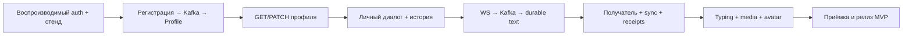

# Andruha: готовность backend MVP и план закрытия

> Исторический снимок от 2026-09-11. Текущее состояние компонентов описано в
> корневом README; часть выявленных здесь пробелов Identity/Profile уже закрыта.

Дата: 11 сентября 2026 года. Аудит текущего локального checkout, включая незакоммиченные изменения. Исходный код и конфигурация не изменялись.

## Решение тимлида

Проект имеет развитую реализацию аутентификации, ядро профилей, часть HTTP API и подготовленные Kafka-контракты. Работающего сквозного MVP мессенджера пока нет: бизнес-реализация Messages, WebSocket Gateway и Object Storage отсутствует. Основной остаток — создание продуктовых сценариев и соединение сервисов, а не косметическое завершение инфраструктуры.

Ближайшая цель: закрыть `register → outbox → Kafka → default profile → GET/PATCH profile` в воспроизводимом окружении. Следующая: два пользователя обмениваются текстом, видят историю и восстанавливают события после обрыва. Только затем закрывать медиа и остальные требования полного MVP.

Не начинать заново уже реализованные outbox, durable idempotency и обработчики Profile. Не делать большой рефакторинг архитектуры условием начала Messages. Архитектурные изменения — отдельные согласованные задачи, если они действительно нужны для конкретного сценария.

## Границы и достоверность

За основу взят backend MVP из `docs/project-overview.md` и `docs/developer-handbook/README.md`: личные диалоги, текст, история, realtime, SENT/DELIVERED/READ, typing, sync, вложения и аватары. Минимальный тестовый клиент входит в завершение; полноценный web/mobile продукт описан в руководстве как отдельный объём.

Проверены корневой репозиторий, все шесть сервисов, entrypoints, состав бизнес-слоёв, DI, настройки, миграции, Docker Compose, gateway, contracts и CI workflows. Глубже проверены Identity и Profile как сервисы с бизнес-реализацией. Это аудит готовности и критического пути, а не полный построчный security review.

Локальная реализация опережает README и handbook. В частности, утверждения «Identity не содержит outbox», «Profile является скелетоном» и «зависимости ещё не объявлены» уже не отражают текущий checkout.

| Репозиторий | Проверенный HEAD | Состояние |
|---|---|---|
| integration | `1431c78` | Есть исходные локальные изменения Compose, документации и submodule pointers |
| api-gateway | `fc4d5b3` | Рабочее дерево чистое, HEAD отличается от ссылки родителя |
| identity-service | `4627933` | Рабочее дерево чистое, HEAD отличается от ссылки родителя |
| user-profile-service | `ccfa5e7` | Есть изменённые и новые файлы HTTP/JWT/тестов; HEAD отличается от ссылки родителя |
| messages-dialogues-service | `4abcfb1` | Рабочее дерево чистое |
| websocket-gateway-service | `61bb670` | Рабочее дерево чистое, HEAD отличается от ссылки родителя |
| object-storage-service | `34515e5` | Рабочее дерево чистое |

Оценка относится к локальным файлам, а не к тому, что получит новый разработчик после клонирования текущего опубликованного родительского коммита. Актуальные результаты GitHub Actions и состояние production не проверялись.

## Что уже готово как строительные блоки

| Блок | Реально реализовано | Граница готовности |
|---|---|---|
| Identity: аутентификация | Register, cookie login, RS256 access token, opaque refresh, session family, refresh rotation, logout, me | Есть application/domain/persistence/HTTP. Unit и lint прошли; реальные DB-интеграции в этом аудите не запускались |
| Identity: идемпотентность | Durable PostgreSQL execution/replay, шифрование результата, Valkey hot path, circuit breaker | Можно использовать существующее решение; повторно проектировать его для MVP не требуется |
| Identity: регистрационный outbox | User и outbox записываются через одну UoW/session; relay с lease, retry, quarantine и защитой владельца claim | Реализация есть. Сквозная публикация через настоящий Kafka и создание Profile ещё не доказаны |
| Profile: предметное и прикладное ядро | Профиль, настройки/privacy, валидация и версии, default creation, update/reset, публичное чтение, batch/search/existence | Обработчики, PostgreSQL readers/repositories, UoW, миграция, CommandBus и durable deduplication уже существуют |
| Profile: HTTP чтение | `GET /api/v1/profiles/me`, `GET /api/v1/profiles/{user_id}`, `POST /api/v1/profiles/batch`; ETag, cache policy и локальная JWT-проверка | Эти маршруты есть в локальных незакоммиченных файлах. Проверены тестами HTTP/JWT с заменёнными persistence ports |
| Kafka contracts | Общие envelopes, registration, message send/persisted/created/rejected, receipt command/event, DLQ и fixtures | JSON Schema и примеры проверяются; это ещё не проверка совместимости всех настоящих producer/consumer |
| Инженерный каркас | Независимые репозитории, Poetry/lock files, Dockerfiles, structured logs, request ID, CI/release workflows, NGINX и топология хранилищ | Описанная топология и workflows не равны работающему интегрированному стенду |

«Готово как блок» не означает «готово к публичному выпуску». Процент общей готовности не присваивается: большой объём тестируемой инфраструктуры не заменяет отсутствующий обмен сообщениями.

## Что почти готово и как закрыть

### Identity и регистрационный поток

Переиспользовать текущие auth, outbox repository, relay и retry policy. Остаток:

1. Согласовать Kafka topic: runtime default — `identity.user-registered.v1`, корневой контракт — `identity.events.v1`. Исправить конфигурацию, fixtures и bootstrap согласованно. Для уже накопленного outbox учесть сохранённое в строках имя topic: смена default не меняет старые записи.
2. Проверить настоящую Kafka-публикацию: broker ACK, перезапуск relay, потерянный ACK, повторная доставка и восстановление после недоступности Kafka.
3. Закрыть длительный отказ брокера. При исчерпании retry budget текущий код переводит даже transient failure в quarantine; автоматическая доставка после recovery этим не гарантируется. Метод redrive есть в repository, но вызывающего operational flow в `src` не найдено. Нужны согласованная retry/redrive policy, доступная команда оператора и сигнал о застрявших регистрациях.
4. Подключить наблюдаемость relay: DI не передаёт observer, используется `_NullOutboxRelayObserver`; в Compose у relay нет собственной healthcheck. Нужны возраст pending, quarantine count, ошибки/heartbeat и проверяемая остановка.
5. Проверить миграции на пустой и уже существующей БД. Единственная baseline использует актуальную `Base.metadata.create_all(checkfirst=True)`; новые модели не добавятся в уже отмеченную Alembic revision автоматически. Зафиксировать воспроизводимую стратегию эволюции схемы до релиза.
6. Подтвердить cookie/JWT flow через настоящий gateway. Он уже преобразует access cookie в Bearer; не требуется переносить JWT-валидацию в NGINX. Перед публичным доступом закрыть Origin/CSRF policy, abuse limits и HTTPS/cookie-конфигурацию.

Критерий закрытия: регистрация при отказе Kafka сохраняется; после восстановления событие доходит до Profile, а повторы и рестарты не создают дублей.

### Profile: текстовый профиль и настройки

Ядро готово существенно лучше транспорта. Остаток:

1. Consumer registration event: schema validation, стабильный event ID, доверенный consumer scope, dispatch существующего `CreateDefaultProfileCommand`, offset commit после durable результата. Для completion marker использовать существующий CommandBus/idempotency, не вводить параллельный Inbox.
2. `PATCH /api/v1/profiles/me`: JWT subject, If-Match, schema validation, dispatch, conflict mapping, новый ETag. Подключить существующий update handler.
3. HTTP settings, username search и bounded internal existence contract. Добавить маршрутизацию `/api/v1/settings/` в gateway при сохранении текущего пути; сейчас её нет.
4. Закрыть разрыв между регистрацией и появлением профиля: предусмотренный руководством lazy repair через существующую команду либо явно пересогласованный контракт ожидания. Текущий `GetMyProfileHandler` при отсутствии записи возвращает domain not found; repair не выполняется.
5. Передать в Compose настройки PostgreSQL, Valkey, JWT public key ring; обеспечить миграции и зависимости старта. Readiness должна проверять необходимые зависимости и готовность auth-конфигурации.
6. Превратить HTTP-заготовки тестов в рабочие проверки с валидными JWT и контролируемыми persistence fixtures. Сейчас старые тесты используют `mock_token_for_*`, новые read-тесты уже используют настоящую криптографическую проверку. Простое добавление route не завершит acceptance.

Критерий закрытия: пользователь после регистрации получает профиль, изменяет его, видит настройки; два PATCH с одной исходной версией дают одного победителя, чужой профиль изменить нельзя, duplicate registration не затирает изменения.

Аватар пока нельзя считать почти готовой продуктовой функцией: `UpdateAvatarHandler` сохраняет `avatar_key`, но не проверяет через Object Storage владельца, purpose и READY. Это часть ещё не реализованного media milestone.

### API Gateway и локальный стенд

NGINX routing, request ID, cookie-to-Bearer и WS upgrade подготовлены. Закрыть:

- точные публичные пути settings, sync и internal boundary;
- конфигурацию, миграции и порядок старта реальных зависимостей;
- интеграционные проверки авторизации через edge;
- публичные ограничения запросов/соединений и согласованную Origin policy;
- различие gateway liveness и готовности продуктового сценария.

`/health/ready` NGINX сейчас всегда отвечает 200. Такой ответ допустим как проверка самого gateway, но не как критерий работоспособности всех сервисов.

## Что не реализовано как продуктовая функция

| Область | Состояние исходников | Необходимая реализация |
|---|---|---|
| Messages and Dialogues | Только operational HTTP bootstrap; domain/application packages пустые | Direct dialogue uniqueness, membership, Cassandra schema/adapters, history/list cursors, message idempotency, canonical persistence, projections, worker, durable events, receipts, sync |
| WebSocket Gateway | Зависимости объявлены, но HTTP app подключает только health; websocket/workers packages пустые | JWT/Origin handshake, connection registry, bounded queues, single writer, heartbeat, expiry, limits, command validation/publish/ACK, dispatcher, fan-out, reconnect behavior |
| Object Storage | Только skeleton, без metadata models, migrations, MinIO adapter и business API | Upload intent, presigned PUT/GET, finalize validation, READY transitions, ownership/purpose, download authorization, cleanup worker |
| Typing | Есть описание целевого поведения | Membership, throttle, ephemeral routing, TTL, исчезновение после disconnect, отсутствие durable history |
| Сквозной тестовый клиент | Исполняемый reference E2E client не найден | Два пользователя, login, profile, dialogue, send/receive, reconnect/sync, receipts, media; machine-readable результат |
| Приёмка MVP | Root CI проверяет build и operational health, а не бизнес-сценарии | E2E, failure injection, границы доступа, reproducible bootstrap, базовая нагрузка и восстановление |

Наличие Kafka, Cassandra и MinIO контейнеров не означает наличия топиков, схем, бакетов, адаптеров, бизнес-ограничений или HA.

## Подтверждённые блокеры и риски

| ID | Приоритет | Наблюдение и влияние | Доказательство |
|---|---|---|---|
| F01 | P0 | Profile не стартует в чистом окружении без DB settings, которых нет в его Compose environment | `docker-compose.yml:78`; `services/user-profile-service/src/app/core/settings/postgres.py:141`; воспроизведён `ValidationError` при `create_app()` без локального .env |
| F02 | P0 | После исправления DB остаются неподключённые JWT keys; authenticated read возвращает 503 при отсутствии verifier | `services/user-profile-service/src/app/entrypoints/http/main.py:31`; `security/settings.py:18`; `dependencies.py` |
| F03 | P0 | Регистрация не приводит к профилю: consumer отсутствует; topic в реализации расходится с контрактом | `services/identity-service/src/app/core/settings/kafka.py:9`; `contracts/README.md:25`; состав Profile entrypoints |
| F04 | P0 | Основные изменения Profile недоступны через HTTP | В router есть только три read routes; интеграционный прогон: PATCH 405, отсутствующие routes 404/ошибки маршрутизации |
| F05 | P0 | Нет ядра сообщений, durable sync и realtime | В трёх соответствующих main.py подключается только health router; бизнес-пакеты пустые |
| F06 | P1 | Длительный Kafka outage может оставить регистрацию в quarantine после recovery | `outbox_relay.py:238`; redrive найден лишь как port/repository method; DI observer не подключён |
| F07 | P1 | Readiness/CI могут создавать неверное представление о готовности продукта | Profile readiness — boolean flag; NGINX — статический 200; root smoke — gateway health без register/chat |
| F08 | P1 | Root CI запускает application-only перечень без identity-relay и инфраструктуры, необходимой текущему Identity/Profile | `.github/workflows/integration.yml:95`; у Identity API в Compose отсутствует dependency на PostgreSQL; current local Profile требует DB settings |
| F09 | P1 | Локальная работоспособность не переносится автоматически на новый checkout | Четыре submodule HEAD отличаются от родителя; Profile transport частично untracked; документация описывает устаревшие стадии |
| F10 | P1 перед публичным выпуском | Нет завершённого публичного security flow и операционной приёмки | В проверенном gateway/auth/profile коде не найдены Origin/CSRF и rate-limit реализации; WS auth вообще не реализована. Это пробел контролей, не утверждение о доказанном exploit |

P0 здесь означает блокирование ближайшего продуктового результата или всего MVP, а не severity действующего production-инцидента.

## Направление разработки

Работать вертикальными сценариями. Ограничить одновременно незавершённую работу одним milestone. Для нескольких разработчиков допустимы отдельные согласованные части внутри текущего milestone; закрытие определяется общим E2E.

«Два пользователя + текст + история + reconnect» — внутренний первый демонстрируемый рубеж. Это не отменяет включённые в полный MVP typing, receipts, вложения и аватары.

## Приоритизированные задачи

Размер: S — локальное изменение с понятной проверкой; M — согласование нескольких модулей/процессов; L — новая подсистема, которую перед реализацией следует разбить на несколько вертикальных PR. Это относительный объём, не календарная оценка. Владелец означает ответственную область, а не назначение конкретного человека.

| ID | Приоритет / размер | Задача и владелец | Зависимость | Критерий приёмки |
|---|---|---|---|---|
| A01 | P0 / M | Integration + Profile: DB/Valkey/JWT env, key mounts, migrations, startup ordering; учесть Identity API и relay | — | Чистый disposable checkout поднимает auth и Profile; нет зависимости от личного .env; DB outage отражается в readiness |
| A02 | P0 / S | Identity + contracts: единый registration topic и bootstrap | — | Сериализованное runtime-событие соответствует schema; topic/key совпадают с контрактом; учтены старые outbox rows |
| A03 | P0 / M | Profile: registration consumer через существующий CommandBus | A01, A02 | Дубли, redelivery и restart создают один profile/settings; offset не опережает durable commit |
| A04 | P0 / M | Integration: первый E2E register → profile, включая Kafka outage/recovery | A03 | Регистрация успешна при выключенном Kafka; после восстановления профиль появляется; DB/worker restart не теряет результат |
| A05 | P0 / M | Profile: PATCH me, If-Match, mapping ошибок, ETag | A01 | Concurrent PATCH с одной версией: один success, один conflict; no token/foreign identity/invalid fields отклоняются |
| A06 | P0 / M | Profile + edge: settings, username search, existence, repair flow | A03, A05 | GET/PATCH settings доступны через gateway; поиск соблюдает privacy; профиль после регистрации восстанавливается по утверждённому контракту |
| A07 | P1 / M | Identity: relay metrics, bounded probes, retry/quarantine/redrive, migration evolution | A02 | Долгий outage и превышение retry budget имеют проверенный путь recovery; зависшая регистрация видна; schema upgrade воспроизводим |
| A08 | P0 / L | Messages: direct dialogues, Cassandra bootstrap/adapter, membership, listing/history cursors | A06 | Concurrent create одной пары возвращает один dialogue; self/foreign dialogue запрещён; cursor pages устойчивы к повторам |
| A09 | P0 / M | WS: authenticated handshake, Origin, registry, writer/queues, heartbeat/expiry, limits | A01, согласованный WS contract | Поддельный/истёкший токен и чужой Origin отклоняются; slow client ограничен; disconnect освобождает registry |
| A10 | P0 / M | WS: send envelope → Kafka, server-derived actor, accepted/rejected protocol | A08, A09 | `command.accepted` только после broker ACK; publish timeout не подтверждает успех; повтор сохраняет clientMessageId |
| A11 | P0 / L | Messages: command consumer, canonical message/idempotency, repairable projections и durable result events | A08, A10 | Потерянный ACK, duplicate command и crash после записи дают один messageId; другой payload с тем же key конфликтует |
| A12 | P0 / M | WS dispatcher: Kafka events → active nodes → все соединения sender/recipient | A11 | Два клиента и несколько устройств получают верные события; sender получает persisted/canonical ID; чужие события не доставляются |
| A13 | P0 / L | Messages + client: durable sync projection, signed cursor, reconnect merge/dedupe | A11, A12 | Offline, потеря Pub/Sub и restart WS закрываются sync без потерь; cursor expiry имеет понятный full-resync путь |
| A14 | P0 / M | Messages + WS + client: DELIVERED/READ watermarks | A13 | Только участник/получатель двигает статус; duplicate/out-of-order ACK не откатывает состояние; READ включает DELIVERED |
| A15 | P1 / M | WS + client: typing через ephemeral routing | A12 | TTL, membership и throttle проверены; disconnect не оставляет зависший индикатор; durable storage не используется |
| A16 | P0 для полного MVP / L | Storage: metadata, migration, private bucket, upload/finalize/download, cleanup | A01, storage contracts | Foreign/pending/corrupt/oversized object отвергается; только verified READY доступен; HEAD/SDK не держат DB lock |
| A17 | P0 для полного MVP / M | Profile + Messages: avatar/attachment integration и authorization download | A14, A16 | В сообщение/профиль попадает только свой READY-object верного purpose; чужой download отклонён; text не зависит от доступности Storage |
| A18 | P0 перед релизом / M | Integration + client: reference E2E, contracts fixtures из runtime DTO, CI pinned service versions | По мере A04–A17 | Новый checkout воспроизводит полный сценарий; CI использует фактические producer/consumer fixtures и обязательные real-infra tests |
| A19 | P0 перед публичным доступом / M | Edge + services: HTTPS/cookie/CSRF/Origin policy, limits, log redaction, negative access tests | До внешнего demo | Проверены cookie auth через edge, запрет spoofing и cross-user access, abuse limits; credentials/content не попадают в диагностику |
| A20 | P0 перед релизом / M | Integration/ops: метрики критического пути, failure suite, baseline load, backup/restore, runbook | A18, A19 | Подтверждены outage/restart/reconnect сценарии, измерены latency/lag/error, выполнен restore; известные ограничения опубликованы |
| A21 | P1 / S | Lead/docs: актуализировать README, handbook, Kanban, статус transport и milestones | После каждого gate | Доска отражает код и evidence; готовая работа не предлагается к повторной реализации |

Самые ранние задачи: A01, A02, A03, A04, A05. A07 необходимо закрыть до объявления регистрационного потока устойчивым к длительным сбоям. A18 начинается минимальным клиентом вместе с A04 и расширяется в каждом milestone; тесты и эксплуатационные требования не откладываются целиком на конец.

## Критерии закрытия milestone

| Рубеж | Наблюдаемый результат |
|---|---|
| G0: registration transport | Согласованный event/topic, реальная доставка Kafka, отсутствие потери регистрации при outage/recovery, redrive для terminal failures |
| G1: profile | Register → profile и собственное редактирование/настройки через gateway; privacy, version conflict и duplicate event проверены |
| G2: dialogue | Два пользователя создают один личный диалог, получают список и историю; неучастник не получает доступ |
| G3: durable text | WS command доходит до Cassandra, sender получает canonical message, повтор после потерянного ACK безопасен |
| G4: reliable conversation | Recipient online/offline, multi-device, sync и монотонные receipts работают после сбоев |
| G5: typing | Индикатор временный, ограничен и автоматически истекает |
| G6: media | Upload/finalize → avatar/attachment → authorized download; отрицательные ownership/purpose tests |
| G7: release | Полный reference E2E в чистом окружении, green required CI, failure/load/restore evidence и runbook |

По текущему аудиту ни один сквозной G0–G7 нельзя объявить подтверждённо закрытым. В G0/G1 уже реализована значительная часть компонентов; это не задача «начать с нуля».

## Что отложить

- Cassandra session store для Identity: существующий PostgreSQL auth нужно сохранить до завершения MVP.
- Групповые чаты, звонки, APNs/FCM и отдельный Notification Service: вне зафиксированного MVP.
- Проектирование под 100 млн DAU, multi-region, Kubernetes/HA-лабораторию и cold storage: после корректности основного сценария и измеренного workload.
- Новый универсальный framework, общий domain package на сервисы, повторную реализацию idempotency/outbox и косметический рефакторинг всех слоёв.

Ограниченность Cassandra partitions, membership, стабильная идемпотентность и восстановление обязательны уже сейчас: перенос масштабирования не означает перенос корректности.

## Выполненные проверки

| Проверка | Результат текущего запуска | Что это подтверждает |
|---|---|---|
| Identity `tests/unit` через `scripts/codex-service.py` | **278 passed** | Проверенные локальные unit-контракты |
| Profile `tests/unit` через helper | **489 passed** | Проверенные domain/application/infrastructure doubles/JWT unit-контракты |
| Profile `tests/integration` через helper | **54 passed, 12 failed, 32 skipped** | HTTP reads/bootstrap проходят; оставшиеся endpoint-контракты не реализованы; DB/Valkey tests пропущены без DSN |
| Identity Ruff + format | **Passed**, 182 файла отформатированы | Lint/format в текущем сервисе |
| Profile Ruff + format | **Passed**, 234 файла отформатированы | Lint/format с учётом локальных HTTP-изменений |
| `contracts/tests` | **4 unittest methods passed**, с проверкой fixtures через subtests | JSON, схемы, camelCase, valid/invalid examples |
| Сгенерированное `UserRegisteredEvent.to_envelope_dict()` против root schema | **0 schema errors** | Сам wire-envelope соответствует схеме; обнаруженная несовместимость касается topic |
| `docker compose config --quiet` | **Passed** | Синтаксическая/структурная валидность Compose; не запуск |
| Profile `create_app()` без личного `.env` и DB env | **Воспроизведён ValidationError** | Обязательный bootstrap не покрыт текущей Compose-конфигурацией |
| Docker daemon | **Недоступен**, named pipe `dockerDesktopLinuxEngine` отсутствует | Реальные контейнерные проверки в этой сессии выполнить нельзя |
| Identity real integration, Kafka E2E, Docker build/up, migrations против real DB | **Не запускались** | Нет нового подтверждения persistence/runtime readiness |
| Messages/Object Storage unit | **Не запущены**: helper не нашёл Poetry environment | Это ограничение окружения, не провал бизнес-тестов |
| WebSocket unit | **Не запущены**: в выбранном Poetry environment отсутствует pytest | Это ограничение окружения, не провал бизнес-тестов |
| Pyright, coverage gate, dependency/secret scans, remote Actions | **Не запускались** | Их успешность в этом отчёте не заявляется |

Для contracts использовано существующее Poetry-окружение Identity: в системном Python отсутствовал `jsonschema`. Установка зависимостей не выполнялась. Реальные PostgreSQL/Valkey результаты из прошлых сессий не подменяют текущие skipped tests.

12 падений Profile относятся к пяти PATCH-тестам, username search, internal HEAD и пяти settings-тестам. Тесты содержат намерение будущего поведения и местами фиктивную auth-заготовку; они сохранены, не удалены и не помечены skipped ради зелёного отчёта.

## Правило готовности одной задачи

Задача закрывается, когда выполнено наблюдаемое поведение, интеграция подключена в production composition root, миграции и конфигурация воспроизводимы, отрицательные/повторные сценарии проверены, а CI и документация соответствуют коду. Наличие модели, handler, schema или 200 на health по отдельности недостаточно.

Исходные незакоммиченные изменения сохранены. Единственное добавление аудита — этот отчёт; реализации предложенных задач он не выполняет.
