# Andruha Messenger MVP - Sequence Diagrams

Статус: design baseline для MVP.

Этот документ описывает не все мыслимые сбои распределенной системы, а полный
набор классов отказов, которые входят в согласованный MVP:

1. validation и business rejection;
2. authentication и authorization failure;
3. duplicate request и broker redelivery;
4. dependency unavailable;
5. timeout с неоднозначным результатом;
6. process crash между durable effect и публикацией ответа;
7. offline client и потеря WebSocket-соединения;
8. poison message и DLQ.

## 1. Границы и инварианты

- MVP поддерживает только диалоги 1:1.
- HTTP-трафик маршрутизирует API Gateway, но бизнес-логики в нем нет.
- Identity, Profile, Messages и WebSocket Gateway проверяют RS256 access token
  локально. Синхронного запроса в Identity на каждый вызов нет.
- Credentials хранятся в Identity PostgreSQL.
- Целевая модель refresh-сессий хранится в Cassandra Session Store; Valkey
  используется только как idempotency guard.
- Messages and Dialogues Service хранит query-driven проекции в Cassandra.
- Kafka работает в режиме at-least-once. Consumers подтверждают offset только
  после durable business effect и обязательной публикации результата.
- Exactly-once не заявляется. Повторы безопасны благодаря idempotency keys,
  client_message_id, event_id и монотонным версиям состояния.
- SENT означает durable запись сообщения в Cassandra.
- DELIVERED устанавливается только после явного ACK от клиента получателя.
- READ устанавливается только после явного ACK, когда сообщение показано
  пользователю. READ поглощает DELIVERED.
- Typing не сохраняется и не переигрывается.
- Notification Service, mobile push, группы, поиск и cold storage не входят в MVP.

## 2. Цветовая легенда

| Цвет | Значение |
|---|---|
| Синий | Client, Load Balancer, API Gateway |
| Зеленый | Application service или worker |
| Фиолетовый | Durable database или object storage |
| Оранжевый | Kafka, Valkey и transient coordination |
| Светло-зеленый фон | Happy path |
| Светло-желтый фон | Retry, timeout или неоднозначный результат |
| Светло-красный фон | Failure path |

## 3. Каталог сценариев

| ID | Use case | Основные failure paths |
|---|---|---|
| AUTH-01 | Registration и создание профиля | invalid payload, duplicate email, PostgreSQL down, outbox lag, duplicate event |
| AUTH-02 | Login | invalid credentials, user changed, session store down, lost response |
| AUTH-03 | Refresh rotation | cached retry, concurrent retry, token reuse, LWT timeout, Valkey/Cassandra down |
| AUTH-04 | Logout | missing token, already revoked, session store down |
| AUTH-05 | Current identity | invalid JWT, disabled user, PostgreSQL down |
| WS-01 | WebSocket connect и lifecycle | invalid JWT, registry down, token expiry, gateway crash |
| PROF-01 | Read и edit profile | 401, validation, version conflict, PostgreSQL down |
| DLG-01 | Create/get 1:1 dialog | self-dialog, unknown user, duplicate create, LWT timeout, partial projection |
| DLG-02 | Dialog list и message history | invalid cursor, forbidden dialog, bucket boundary, Cassandra down |
| MSG-01 | Accept send command | malformed frame, unauthorized, rate limit, Kafka down, duplicate request |
| MSG-02 | Persist и fan-out message | non-member, Cassandra down, crash before event, duplicate event, recipient offline |
| RCPT-01 | Delivered/read receipts | out-of-order ACK, duplicate ACK, unauthorized ACK, dependency failure |
| TYP-01 | Typing | throttling, Valkey down, disconnect, offline recipient |
| SYNC-01 | Reconnect и catch-up | expired token, invalid cursor, Cassandra down, concurrent realtime event |
| OBJ-01 | Upload и finalize | invalid media, expired URL, interrupted upload, checksum mismatch, lost response |
| OBJ-02 | Media attachment и download | foreign object, not ready, Storage down, forbidden download |
| AVT-01 | Set avatar | wrong MIME, foreign object, version conflict, dependency failure |

---

## AUTH-01. Registration и асинхронное создание профиля

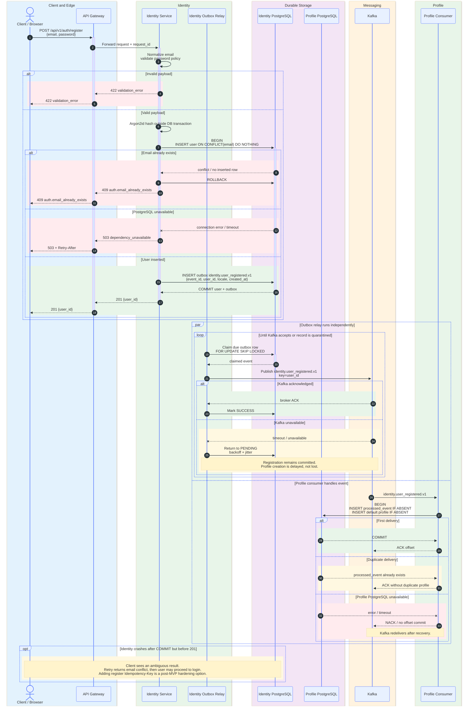

### AUTH-01 decisions

- User and outbox event commit atomically.
- Profile creation is eventually consistent and idempotent.
- Kafka or Profile failure does not roll back registration.
- A missing profile must be treated by Profile API as a temporary provisioning
  state, not as proof that Identity user does not exist.

---

## AUTH-02. Login и создание session family

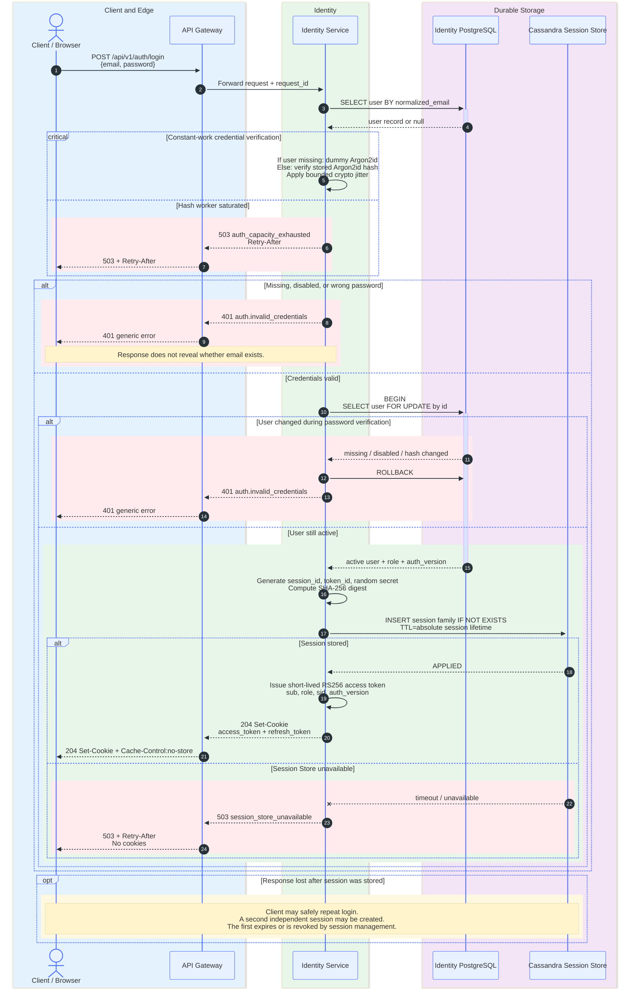

### AUTH-02 decisions

- Argon2id never holds a database transaction or connection.
- No token is returned unless session state is durably stored.
- Creating two sessions after an ambiguous login retry is acceptable for MVP.

---

## AUTH-03. Refresh rotation, safe retry и replay detection

```mermaid
%%{init: {"theme":"base","themeVariables":{"actorBkg":"#E8F1FF","actorBorder":"#4C6FFF","signalColor":"#263238","noteBkgColor":"#FFF4CC","activationBkgColor":"#D7E4FF","sequenceNumberColor":"#FFFFFF"}}}%%
sequenceDiagram
    autonumber
    box rgb(227, 242, 253) Client and Edge
        actor C as Client / Browser
        participant API as API Gateway
    end
    box rgb(232, 245, 233) Identity
        participant EP as Auth HTTP Entrypoint
        participant ID as Identity App Service
    end
    box rgb(255, 243, 224) Coordination
        participant V as Valkey Idempotency Guard
    end
    box rgb(243, 229, 245) Durable Storage
        participant SS as Cassandra Session Store
    end

    C->>+API: POST /api/v1/auth/refresh<br/>Cookie=RT_1, Idempotency-Key=K1
    API->>+EP: Forward cookie + K1
    EP->>EP: Digest request payload<br/>scope key=auth:refresh:K1
    EP->>+V: Atomic acquire/read(K1, payload_hash)

    alt Same token + same key, completed within window
        rect rgb(232, 245, 233)
            V-->>EP: COMPLETED + cached TokenPair_2
            Note over EP,ID: Do not call rotation again.
            EP-->>API: 204 Set-Cookie TokenPair_2
            API-->>C: 204 cached response
        end
    else Same key is currently processing
        rect rgb(255, 248, 225)
            V-->>EP: IN_PROGRESS
            EP-->>API: 423 auth.refresh_in_progress<br/>Retry-After
            API-->>C: 423<br/>retry same K1
        end
    else Same key + different payload
        rect rgb(255, 235, 238)
            V-->>EP: PAYLOAD_MISMATCH
            EP-->>API: 409 idempotency_payload_mismatch
            API-->>C: 409<br/>do not retry with K1
        end
    else Valkey unavailable
        rect rgb(255, 235, 238)
            V--xEP: unavailable / timeout
            EP-->>API: 503 idempotency_store_unavailable
            API-->>C: 503 + Retry-After
            Note over EP,SS: Fail closed. Rotation is not invoked<br/>without safe-retry protection.
        end
    else First request owns K1
        V-->>-EP: ACQUIRED
        EP->>+ID: rotate(RT_1)
        ID->>ID: Parse non-secret session_id/token_id<br/>Digest secret

        critical Atomic compare-and-set rotation
            ID->>+SS: LWT IF active AND current_token_id=T1<br/>AND digest=SHA256(RT_1)<br/>SET current_token=T2, extend idle expiry
            SS-->>-ID: applied + session snapshot
        option LWT timeout with unknown outcome
            rect rgb(255, 248, 225)
                SS--xID: timeout / WriteTimeout
                ID->>SS: Resolve by SERIAL read of session
                alt Session already points to T2 from this request
                    SS-->>ID: rotation committed
                    ID->>ID: Reconstruct stored pending result
                else Session still points to T1
                    SS-->>ID: rotation not applied
                    ID->>SS: Retry bounded LWT
                else State cannot be proven
                    SS-->>ID: unknown / unavailable
                    ID-->>EP: 503 refresh_result_unknown
                    EP->>V: Keep short-lived IN_PROGRESS marker
                    EP-->>API: 503 + Retry-After
                    API-->>C: Retry same token + same K1
                end
            end
        end

        alt LWT applied - happy path
            rect rgb(232, 245, 233)
                ID->>ID: Issue AccessToken_2 + opaque RT_2
                ID-->>EP: TokenPair_2
                EP->>V: Store COMPLETED TokenPair_2 with TTL
                alt Cache write succeeded
                    V-->>EP: stored
                else Cache write failed after durable rotation
                    rect rgb(255, 248, 225)
                        V--xEP: timeout
                        Note over EP,V: Response may still be returned.<br/>If it is lost, next retry may look like reuse.<br/>Production hardening stores recoverable<br/>rotation result in Session Store.
                    end
                end
                EP-->>API: 204 Set-Cookie AccessToken_2 + RT_2
                API-->>C: 204 + no-store
            end
        else Token missing, expired, revoked, or malformed
            rect rgb(255, 235, 238)
                SS-->>ID: NOT_APPLIED + inactive/not_found
                ID-->>EP: InvalidRefreshToken
                EP->>V: Store terminal 401 result for K1
                EP-->>API: 401 + Clear-Cookie
                API-->>C: 401<br/>login required
            end
        else RT_1 was already consumed with another key
            rect rgb(255, 235, 238)
                SS-->>ID: NOT_APPLIED + prior token recognized
                ID->>SS: LWT revoke session family IF active
                SS-->>ID: revoked or already revoked
                ID-->>EP: RefreshTokenReused
                EP->>V: Store terminal 401 result for K1
                EP-->>API: 401 + Clear-Cookie
                API-->>C: 401<br/>login required
                Note over ID,SS: Reuse is treated as possible token theft.
            end
        else Cassandra unavailable before a proven result
            rect rgb(255, 235, 238)
                SS--xID: unavailable
                ID-->>EP: 503 session_store_unavailable
                EP->>V: Release or expire K1 ownership
                EP-->>API: 503 + Retry-After
                API-->>C: Retry same RT_1 + same K1
            end
        end
    end

    opt HTTP response is lost
        rect rgb(255, 248, 225)
            C->>API: Retry RT_1 + same K1
            Note over C,V: COMPLETED cache returns the exact same TokenPair_2.<br/>Business rotation is not executed twice.
        end
    end
```

### AUTH-03 critical invariant

The durable store must retain enough data to recover TokenPair_2 after an
ambiguous LWT or a failed Valkey result write. Otherwise a legitimate retry can
be misclassified as theft. A practical model stores an encrypted pending
rotation result or a short-lived recoverable next-token secret in the same
session partition.

---

## AUTH-04. Idempotent logout

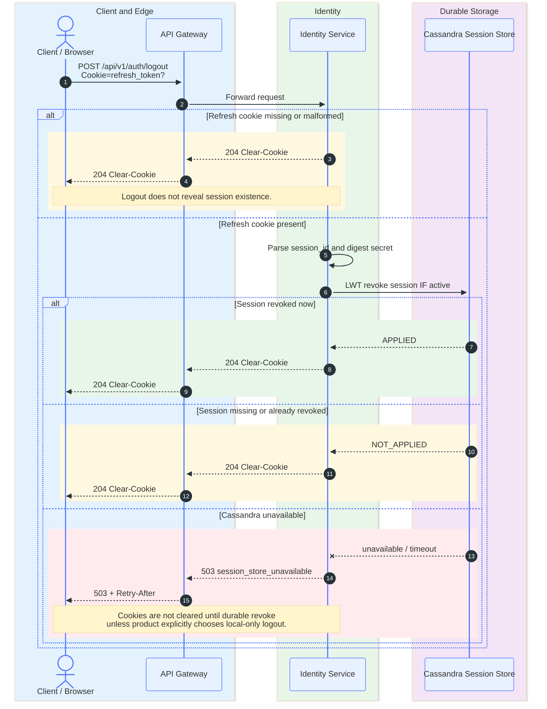

### AUTH-04 decision

MVP uses fail-closed logout: if durable revocation cannot be confirmed, the
client receives 503 and retries. This avoids showing successful logout while
the refresh token is still usable.

---

## WS-01. WebSocket connect, heartbeat и connection lifecycle

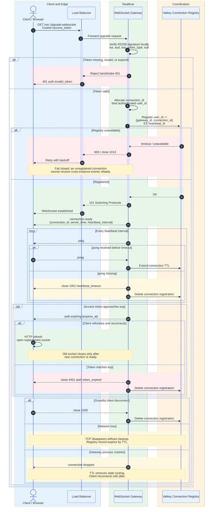

### WS-01 decisions

- Multiple concurrent connections per user are allowed.
- The access token is validated once during handshake and its expiry schedules
  mandatory reconnect.
- Connection registry is routing metadata, not presence history.
- Sticky sessions are not needed after the WebSocket handshake because the TCP
  connection stays attached to one Gateway instance.

---

## PROF-01. Read and edit own profile

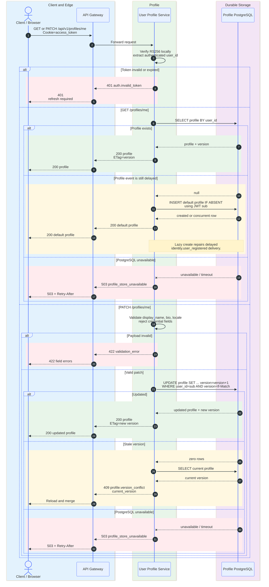

### PROF-01 decisions

- Email, password, role and account status never belong to Profile Service.
- Valid JWT subject is sufficient for lazy creation of the caller's own profile.
- Concurrent edits are detected through version, not last-write-wins.

---

## DLG-01. Idempotent creation of a 1:1 dialog

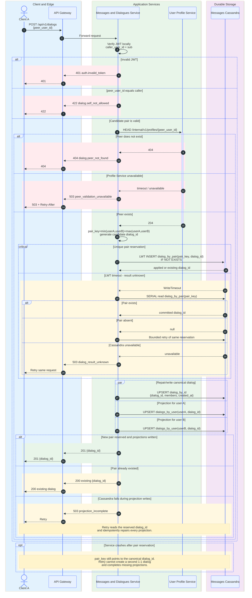

### DLG-01 decisions

- Uniqueness is defined by canonical pair_key, not by a distributed lock.
- Cross-partition projections are repaired idempotently after partial failure.
- The synchronous Profile check exists only on dialog creation. Message sending
  does not depend on Profile Service.

---

## MSG-01. WebSocket command acceptance

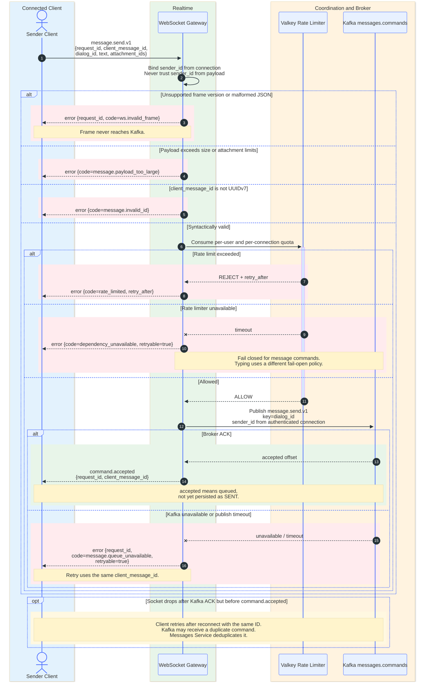

### MSG-01 decisions

- WebSocket Gateway validates transport shape, not dialog membership.
- command.accepted confirms only durable Kafka acceptance.
- The client keeps the message in PENDING until message.persisted is received.

---

## MSG-02. Durable message processing and realtime fan-out

```mermaid
%%{init: {"theme":"base","themeVariables":{"actorBkg":"#E8F1FF","actorBorder":"#4C6FFF","signalColor":"#263238","noteBkgColor":"#FFF4CC","activationBkgColor":"#D7E4FF","sequenceNumberColor":"#FFFFFF"}}}%%
sequenceDiagram
    autonumber
    box rgb(227, 242, 253) Clients
        actor A as Sender Client
        actor B as Recipient Client
    end
    box rgb(255, 243, 224) Kafka
        participant KC as messages.commands
        participant KE as messages.events
        participant DLQ as messages.commands.dlq
    end
    box rgb(232, 245, 233) Messaging
        participant MW as Messages Worker
    end
    box rgb(243, 229, 245) Durable Storage
        participant C as Messages Cassandra
    end
    box rgb(232, 245, 233) Realtime
        participant D as WS Event Dispatcher
        participant WSA as Sender WS Node
        participant WSB as Recipient WS Node
    end
    box rgb(255, 243, 224) Routing
        participant V as Valkey Registry and PubSub
    end

    KC->>+MW: message.send.v1<br/>key=dialog_id
    MW->>MW: Validate version and contract

    alt Poison envelope or unsupported contract
        rect rgb(255, 235, 238)
            MW->>DLQ: Publish original envelope + safe error metadata
            DLQ-->>MW: broker ACK
            MW-->>KC: ACK command offset
            Note over KC,DLQ: Poison does not block the partition.
        end
    else Valid command
        MW->>+C: Read dialog_by_id at LOCAL_QUORUM
        alt Dialog missing or sender is not a member
            rect rgb(255, 235, 238)
                C-->>MW: missing / non-member
                MW->>KE: Publish message.rejected.v1<br/>target_user_id=sender<br/>client_message_id
                KE-->>MW: broker ACK
                MW-->>KC: ACK command offset
            end
        else Cassandra unavailable
            rect rgb(255, 235, 238)
                C--xMW: unavailable / timeout
                MW-->>KC: NACK / no offset commit
                Note over KC,C: Kafka redelivers with backoff.<br/>No rejection is sent for a transient failure.
            end
        else Sender is a member
            C-->>-MW: dialog + peer_user_id
            MW->>MW: Compute payload_hash<br/>prepare canonical message snapshot

            critical Idempotency reservation
                MW->>+C: LWT INSERT message_request_by_sender_bucket<br/>(sender_id, client_message_id,<br/>payload_hash, canonical snapshot) IF NOT EXISTS
                C-->>-MW: first reservation or existing snapshot
            option LWT timeout
                rect rgb(255, 248, 225)
                    C--xMW: WriteTimeout
                    MW->>C: SERIAL read by sender_id + client_message_id
                    alt Reservation exists
                        C-->>MW: canonical snapshot
                    else Reservation absent
                        C-->>MW: null
                        MW->>C: Bounded retry of identical LWT
                    else Result cannot be resolved now
                        C--xMW: unavailable
                        MW-->>KC: NACK
                    end
                end
            end

            alt Same client_message_id with different payload_hash
                rect rgb(255, 235, 238)
                    MW->>KE: Publish message.rejected.v1<br/>code=idempotency_payload_mismatch
                    KE-->>MW: broker ACK
                    MW-->>KC: ACK command offset
                end
            else First or safe duplicate command
                par Idempotent timeline projection
                    MW->>C: UPSERT messages_by_dialog_bucket<br/>message status=SENT
                and Sender inbox projection
                    MW->>C: UPSERT sync_events_by_user(sender)<br/>message.persisted
                and Recipient inbox projection
                    MW->>C: UPSERT sync_events_by_user(recipient)<br/>message.created
                and Dialog summary projections
                    MW->>C: UPSERT dialog summaries for both users
                end

                alt Every required projection confirmed
                    rect rgb(232, 245, 233)
                        MW->>+KE: Publish message.persisted.v1 for sender<br/>and message.created.v1 for recipient<br/>event_id deterministic per target
                        alt Kafka event ACK
                            KE-->>MW: accepted
                            MW-->>-KC: ACK command offset
                        else Kafka events unavailable
                            rect rgb(255, 248, 225)
                                KE--xMW: timeout / unavailable
                                MW-->>KC: NACK / no offset commit
                                Note over KC,C: Command redelivery loads the same<br/>idempotency snapshot, repairs projections,<br/>and republishes deterministic events.
                            end
                        end
                    end
                else Projection write failed
                    rect rgb(255, 248, 225)
                        C--xMW: partial success / timeout
                        MW-->>KC: NACK
                        Note over MW,C: Existing canonical snapshot allows<br/>idempotent projection repair on redelivery.
                    end
                end
            end
        end
    end

    par Sender realtime event
        KE->>+D: message.persisted.v1<br/>target_user_id=sender
        D->>+V: Resolve active gateway_ids(sender)
        alt Sender has active connections
            V-->>D: gateway_id list
            D->>V: PUBLISH gateway:{id}
            V-->>WSA: event
            WSA-->>A: message.persisted<br/>{message_id, client_message_id, SENT}
        else Sender offline
            rect rgb(255, 248, 225)
                V-->>D: empty
                Note over A,C: Durable sync projection remains available.
            end
        else Registry unavailable
            rect rgb(255, 248, 225)
                V--xD: timeout
                D-->>KE: NACK for bounded retry
            end
        end
        D-->>KE: ACK after routing attempt
    and Recipient realtime event
        KE->>+D: message.created.v1<br/>target_user_id=recipient
        D->>+V: Resolve active gateway_ids(recipient)
        alt Recipient online
            V-->>D: gateway_id list
            D->>V: PUBLISH gateway:{id}
            V-->>WSB: event
            WSB-->>B: message.created<br/>{message, status=SENT}
            Note over B,WSB: Push alone does not mark DELIVERED.<br/>Client must send an explicit receipt.
        else Recipient offline
            rect rgb(255, 248, 225)
                V-->>D: empty
                Note over B,C: Message stays SENT.<br/>Recipient obtains it through /sync.
            end
        end
        D-->>KE: ACK after routing attempt
    end

    opt Dispatcher or WS Node crashes after push but before ACK
        rect rgb(255, 248, 225)
            Note over A,KE: Kafka may redeliver the event.<br/>Client deduplicates by event_id and message_id.
        end
    end
```

### MSG-02 critical invariants

- The idempotency reservation stores the complete canonical snapshot required to
  repair every projection after a partial write.
- Event IDs are deterministic for message, event type and target user.
- A broker ACK without a client ACK never means DELIVERED.
- Valkey Pub/Sub is only a low-latency hint. Cassandra sync projection is the
  source for catch-up.

---

## RCPT-01. Delivered and read receipts

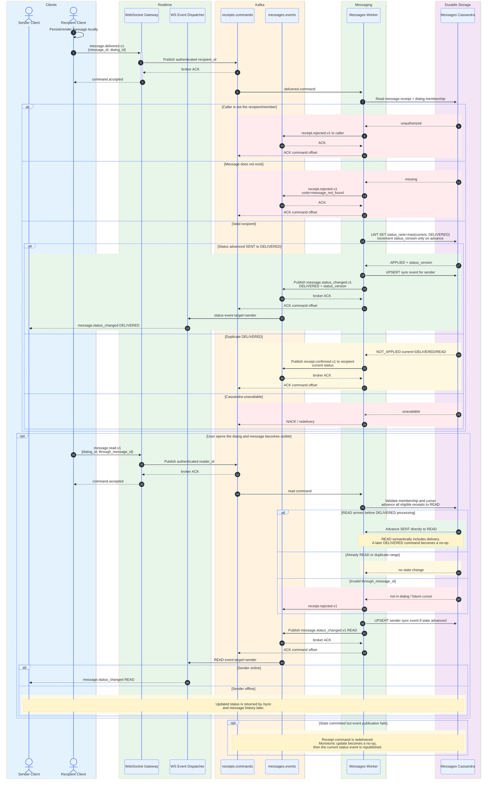

### RCPT-01 decisions

- Status transitions use numeric rank and version; backward transitions are
  impossible.
- A read range is preferable to one command per message.
- Duplicate ACKs return the current state and never create a second transition.

---

## TYP-01. Ephemeral typing status

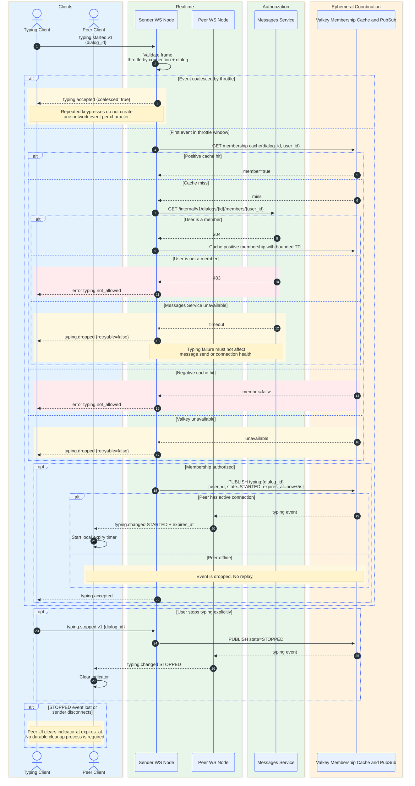

### TYP-01 decisions

- Typing is best-effort and explicitly fail-open relative to core messaging.
- Recipient UI expiration is authoritative; Redis keyspace expiry notifications
  are not required.
- Authorization is cached, but a cache miss never grants access.

---

## SYNC-01. Reconnect and catch-up without event loss

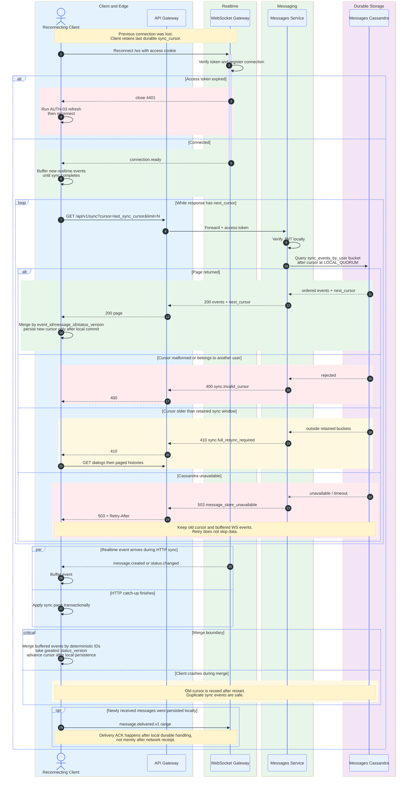

### SYNC-01 decisions

- Realtime delivery is an optimization; sync projection closes every gap.
- Client cursor advances only after the corresponding page is committed locally.
- Concurrent WebSocket events and HTTP catch-up are merged by deterministic IDs
  and monotonic status_version.

---

## AUTH-05. Current identity

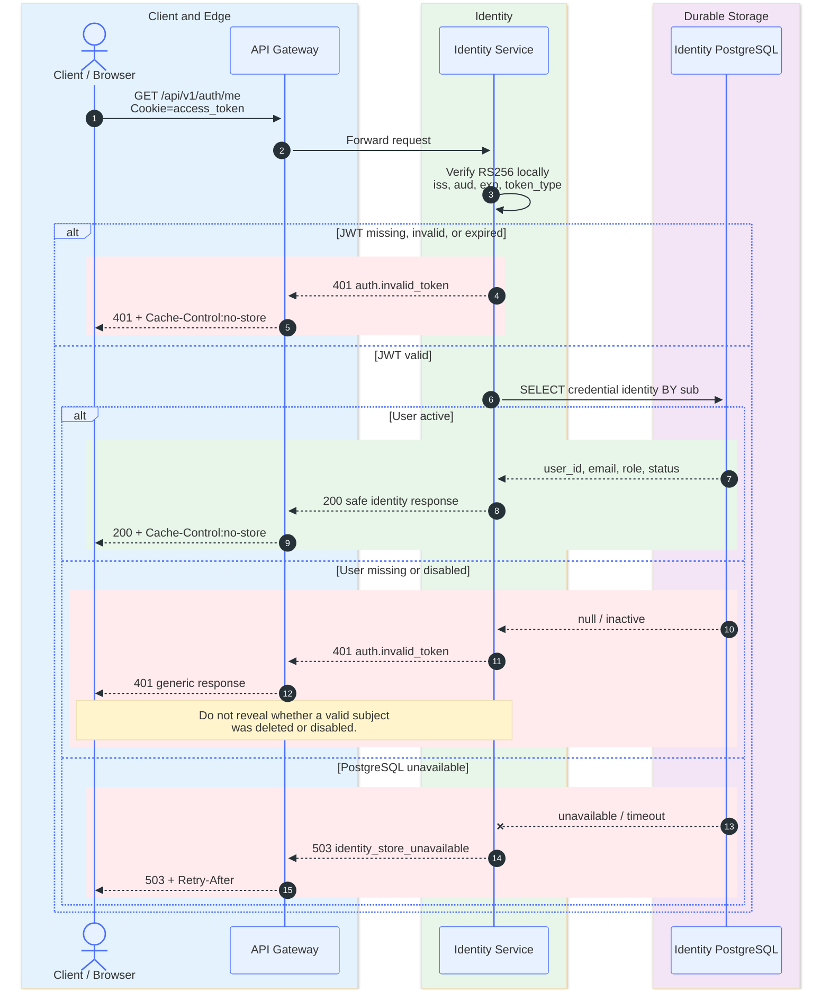

### AUTH-05 decision

Identity /me exposes credential-side fields only. Display name, bio, locale and
avatar are read from User Profile Service.

---

## DLG-02. List dialogs and read message history

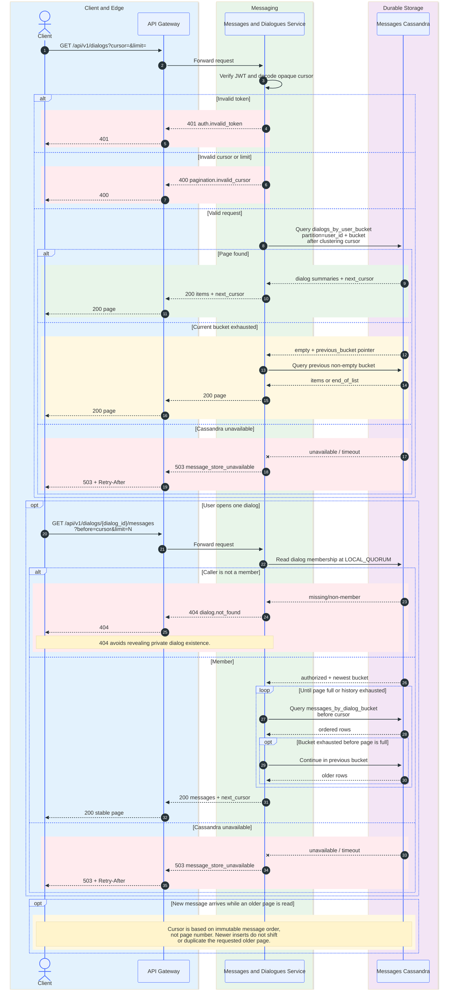

### DLG-02 decisions

- Every cursor is opaque, user-bound and contains the active time bucket plus
  clustering position.
- Private dialog lookup returns 404 to non-members.
- Page-number pagination is forbidden because concurrent messages make it
  unstable.

---

## OBJ-01. Request upload, direct PUT and finalize

```mermaid
%%{init: {"theme":"base","themeVariables":{"actorBkg":"#E8F1FF","actorBorder":"#4C6FFF","signalColor":"#263238","noteBkgColor":"#FFF4CC","activationBkgColor":"#D7E4FF","sequenceNumberColor":"#FFFFFF"}}}%%
sequenceDiagram
    autonumber
    box rgb(227, 242, 253) Client and Edge
        actor C as Client / Browser
        participant API as API Gateway
    end
    box rgb(232, 245, 233) Object Storage
        participant S as Object Storage Gateway Service
        participant CL as Pending Upload Cleanup Worker
    end
    box rgb(243, 229, 245) Durable Storage
        participant PG as Storage Metadata PostgreSQL
        participant O as MinIO
    end

    C->>+API: POST /api/v1/objects/uploads<br/>{purpose, filename, size, media_type, checksum}<br/>Idempotency-Key=K
    API->>+S: Forward request
    S->>S: Verify JWT locally<br/>validate purpose-specific limits

    alt Invalid size, media type, filename, or checksum
        rect rgb(255, 235, 238)
            S-->>API: 413 / 415 / 422
            API-->>C: validation error
        end
    else Valid upload intent
        S->>+PG: INSERT upload intent IF ABSENT<br/>{object_id, owner_id, object_key,<br/>expected metadata, status=PENDING}
        alt Same K + same payload
            rect rgb(255, 248, 225)
                PG-->>S: existing PENDING/READY object
            end
        else Same K + different payload
            rect rgb(255, 235, 238)
                PG-->>S: idempotency conflict
                S-->>API: 409 idempotency_payload_mismatch
                API-->>C: 409
            end
        else Metadata store unavailable
            rect rgb(255, 235, 238)
                PG--xS: unavailable
                S-->>API: 503 storage_metadata_unavailable
                API-->>C: 503 + Retry-After
            end
        else Intent created
            PG-->>-S: object_id + generated object_key
            S->>S: Generate short-lived presigned PUT<br/>signed size/type/checksum constraints
            S-->>-API: 201 {object_id, upload_url, expires_at}
            API-->>-C: 201 upload ticket
        end
    end

    C->>+O: PUT presigned URL<br/>binary + required headers
    alt Upload completed
        rect rgb(232, 245, 233)
            O-->>C: 200 / ETag
        end
    else URL expired
        rect rgb(255, 248, 225)
            O-->>C: 403 SignatureExpired
            C->>API: POST /uploads/{object_id}/renew
            API->>S: Renew request for same owner
            S->>PG: Verify PENDING and owner_id
            PG-->>S: valid
            S-->>API: new presigned PUT
            API-->>C: 200 new URL
        end
    else Network interruption or MinIO unavailable
        rect rgb(255, 248, 225)
            O--xC: timeout / partial upload
            Note over C,O: Client retries the same object key<br/>or renews the URL. PENDING is not READY.
        end
    end

    C->>+API: POST /api/v1/objects/{object_id}/finalize<br/>Idempotency-Key=F
    API->>+S: Forward finalize
    S->>+PG: SELECT object FOR UPDATE by object_id

    alt Foreign object
        rect rgb(255, 235, 238)
            PG-->>S: owner mismatch
            S-->>API: 404 object.not_found
            API-->>C: 404
        end
    else Object already READY
        rect rgb(255, 248, 225)
            PG-->>S: READY metadata
            S-->>API: 200 same object descriptor
            API-->>C: 200 idempotent result
        end
    else PENDING object
        PG-->>-S: expected metadata + object_key
        S->>+O: HEAD object
        alt Object missing or upload incomplete
            rect rgb(255, 248, 225)
                O-->>S: 404 / incomplete
                S-->>API: 409 upload.not_complete
                API-->>C: 409<br/>retry finalize later
            end
        else Size/checksum/type mismatch
            rect rgb(255, 235, 238)
                O-->>S: actual metadata
                S->>PG: UPDATE status=REJECTED + reason
                S-->>API: 422 upload.integrity_mismatch
                API-->>C: 422
                S->>O: Best-effort delete rejected object
            end
        else MinIO unavailable
            rect rgb(255, 235, 238)
                O--xS: unavailable / timeout
                S-->>API: 503 object_store_unavailable
                API-->>C: 503 + Retry-After
            end
        else Metadata matches
            rect rgb(232, 245, 233)
                O-->>-S: actual metadata
                S->>PG: UPDATE status=READY<br/>store trusted metadata
                PG-->>S: COMMIT
                S-->>API: 200 object descriptor
                API-->>C: 200 READY
            end
        end
    else Metadata PostgreSQL unavailable
        rect rgb(255, 235, 238)
            PG--xS: unavailable / timeout
            S-->>API: 503 storage_metadata_unavailable
            API-->>C: 503 + Retry-After
        end
    end

    opt Finalize response is lost after READY commit
        rect rgb(255, 248, 225)
            C->>API: Retry finalize with same F
            Note over C,PG: READY branch returns the same descriptor.<br/>No duplicate object is created.
        end
    end

    loop Periodic bounded cleanup
        CL->>PG: Claim expired PENDING/REJECTED records
        PG-->>CL: bounded batch
        CL->>O: Delete orphan object keys if present
        CL->>PG: Mark cleaned / delete metadata by policy
    end
```

### OBJ-01 decisions

- Application bytes do not pass through Object Storage Gateway.
- object_key is generated by the service and never selected by the client.
- A successful PUT is not sufficient; only finalized READY objects may be used.
- Antivirus and deep content inspection are post-MVP. Size, checksum, declared
  media type and purpose-specific allowlists are part of MVP.

---

## OBJ-02. Attach media to a message and download it

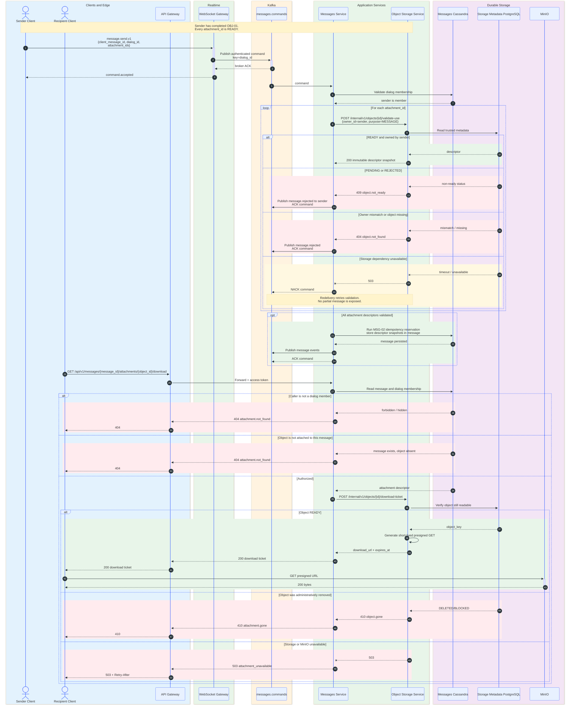

### OBJ-02 decisions

- A message stores a trusted immutable attachment metadata snapshot, never a
  permanent public URL.
- Download authorization belongs to Messages Service because it owns dialog
  membership.
- Storage Service signs bytes only after receiving an internal authorization
  decision from the owning business service.

---

## AVT-01. Set or replace profile avatar

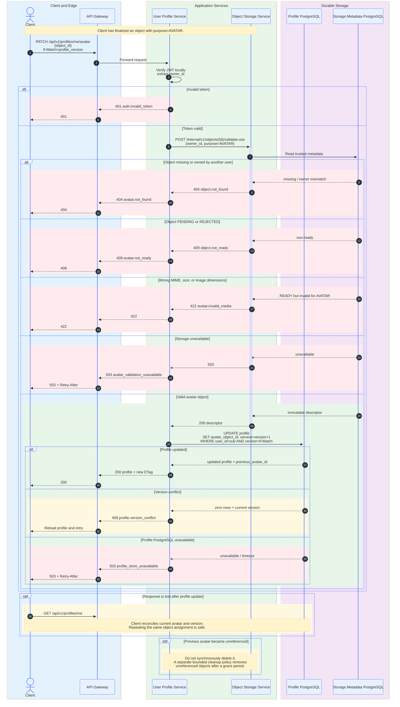

### AVT-01 decisions

- Profile Service owns the avatar reference; Storage Service owns the object.
- Replacing an avatar never performs object deletion inside the profile
  transaction.
- The same optimistic profile version protects text fields and avatar changes.

---

## 4. Client retry contract

| Situation | Client behavior |
|---|---|
| 400, 404, 409 payload mismatch, 413, 415, 422 | Do not retry unchanged request |
| 401 access token expired | Run refresh once, then repeat the original operation |
| 401 refresh invalid/reused | Clear local auth state and require login |
| 423 refresh in progress | Retry same refresh token and same Idempotency-Key after Retry-After |
| 429 rate limited | Retry after server delay with the same client_message_id |
| 503 before command.accepted | Retry with backoff and the same operation ID |
| command.accepted but no message.persisted | Keep message PENDING; reconnect and call /sync; retry same client_message_id if unresolved |
| WebSocket disconnect | Reconnect with jitter, call /sync from last committed cursor |
| Upload PUT interrupted | Retry same object ticket or renew it; do not create another object ID |
| Finalize response lost | Repeat finalize with the same object ID and Idempotency-Key |

## 5. Server-side failure contract

| Boundary | Durable fence | Retry behavior |
|---|---|---|
| Identity registration -> Kafka | PostgreSQL transactional outbox | Relay retries; Profile consumer deduplicates event_id |
| Refresh rotation | Cassandra LWT + recoverable rotation result | Same Idempotency-Key returns same token pair |
| WS command -> Kafka | Kafka broker ACK | No command.accepted before ACK |
| Kafka command -> Cassandra | Canonical idempotency snapshot | Redelivery repairs projections |
| Cassandra -> Kafka event | Command offset remains uncommitted | Redelivery republishes deterministic event_id |
| Kafka event -> WebSocket | Client dedupe + Cassandra /sync | Duplicate push is safe; missed push is caught up |
| Receipt update | Monotonic status_rank + status_version | Duplicate/out-of-order ACK cannot move state backward |
| Media upload | Metadata state PENDING -> READY | Finalize is idempotent |

## 6. Explicitly deferred diagrams

The following flows are outside MVP and intentionally have no sequence diagrams:

- group chat membership changes;
- mobile push through APNs/FCM;
- edit/delete message;
- reactions, replies and forwarding;
- user presence history;
- moderation, antivirus and transcoding;
- CDN cache invalidation;
- multi-region failover;
- SSD to HDD migration;
- end-to-end encryption and key exchange.
