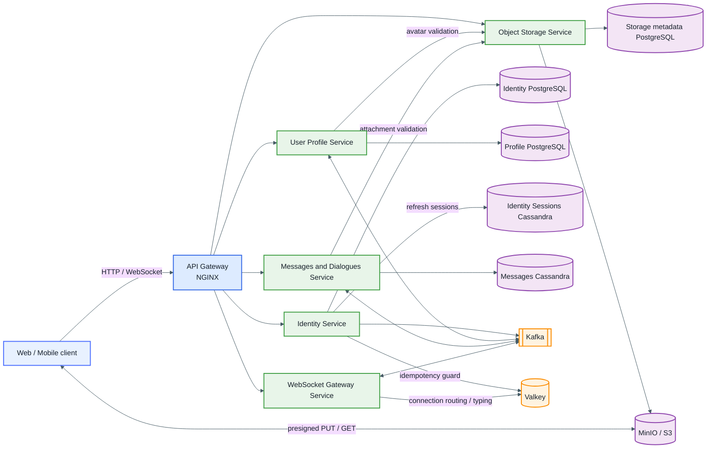

# Andruha Messenger: замысел и архитектура MVP

**Статус:** обзор целевой архитектуры MVP

**Актуально на:** 2026-08-17

## Коротко о проекте

Andruha Messenger — учебный, но спроектированный по production-подходам мессенджер. Его главная цель — на практике пройти полный путь создания realtime-системы: WebSocket-соединения, асинхронные события, идемпотентность, Cassandra, S3-совместимое хранилище и горизонтальное масштабирование.

MVP ограничен личными диалогами 1:1. Пользователь сможет зарегистрироваться, изменить профиль, создать диалог, отправить текст или медиафайл, получить сообщение в реальном времени, увидеть статусы доставки и прочтения, индикатор «печатает...», а после переподключения восстановить пропущенные события.

Это не попытка сразу повторить Telegram. Сначала строится небольшое, законченное ядро с понятными границами ответственности и корректным поведением при повторах, сбоях и временной недоступности зависимостей.

## Что входит в MVP

- регистрация, вход, refresh-сессии, выход и получение текущей identity;
- чтение и редактирование собственного профиля;
- аватар профиля;
- создание или получение личного диалога 1:1;
- список диалогов и история сообщений с cursor pagination;
- отправка и получение текстовых сообщений;
- вложения в сообщения через S3-совместимое хранилище;
- состояния сообщения `SENT`, `DELIVERED`, `READ`;
- индикатор набора текста;
- несколько одновременных WebSocket-соединений одного пользователя;
- переподключение и синхронизация пропущенных событий;
- уведомления внутри подключенного клиента о сообщениях и изменениях их статусов.

Отдельного Notification Service и мобильных push-уведомлений через APNs/FCM в MVP нет.

## Что сознательно отложено

- групповые чаты и управление участниками;
- редактирование и удаление сообщений;
- реакции, ответы и пересылка;
- поиск;
- история присутствия пользователя;
- E2E-шифрование и обмен ключами;
- антивирус, модерация и транскодирование медиа;
- CDN и multi-region failover;
- перенос старых сообщений с SSD на дешевые HDD.

Холодное хранение остаётся будущей задачей: сообщения предполагается хранить постоянно, первый год — на горячих SSD-узлах, затем переносить на более дешёвые HDD-узлы. В MVP этот lifecycle не реализуется.

## Общая архитектура

Публичный трафик входит через API Gateway. Он маршрутизирует HTTP и WebSocket, задаёт доверенный `X-Request-Id`, ведёт безопасный access log и настраивает transport timeouts. Gateway не проверяет бизнес-правила, не ходит в сессии и не принимает решений о доступе к диалогам.

Identity, Profile, Messages и WebSocket Gateway локально проверяют подпись короткоживущего RS256 access token. Поэтому обычный запрос или WebSocket-команда не создают синхронный вызов в Identity Service.

## Ответственность сервисов

### API Gateway

Единая внешняя точка входа. Отвечает за маршрутизацию, WebSocket upgrade, ограничения transport-уровня, доверенный request ID и access logs. Не содержит JWT/RBAC и доменной логики.

### Identity Service

Владеет учётной записью: email, password hash, роль, статус и жизненный цикл аутентификационных сессий. Credentials хранятся в PostgreSQL с необходимой strong consistency. Целевая модель refresh-сессий хранится отдельно в Cassandra, а Valkey ускоряет безопасные повторные refresh-запросы, но не является источником истины.

При регистрации Identity атомарно сохраняет пользователя и outbox-событие. Профиль создаётся асинхронно, поэтому сбой Kafka или Profile Service не откатывает уже созданную учётную запись.

Identity не владеет display name, bio, locale и аватаром.

### User Profile Service

Владеет редактируемым профилем: отображаемым именем, описанием, локалью и ссылкой на аватар. Данные хранятся в отдельном PostgreSQL. Профиль создаётся по событию регистрации идемпотентно; для собственного профиля допустимо безопасное lazy creation по валидному JWT subject.

Конкурирующие изменения защищаются версией профиля и `If-Match`, а не правилом last-write-wins. Сам файл аватара принадлежит Object Storage Service — Profile хранит только ссылку на объект.

### Messages and Dialogues Service

Владеет личными диалогами, их участниками, сообщениями и состояниями доставки/прочтения. Здесь проверяется членство пользователя в диалоге и принимается окончательное бизнес-решение о сохранении сообщения.

Основное хранилище — Cassandra с таблицами, спроектированными от access patterns: список диалогов пользователя, история по диалогу и временным bucket, sync-проекция пользователя. Денормализованные проекции должны восстанавливаться идемпотентно после частичного сбоя.

Сервис не управляет WebSocket-соединениями и не хранит байты вложений.

### WebSocket Gateway Service

Держит долгоживущие соединения, принимает realtime-команды, публикует их в Kafka и доставляет клиентам события. После broker ACK он может ответить `command.accepted`, но это ещё не означает, что сообщение сохранено.

Gateway поддерживает несколько соединений одного пользователя. Valkey хранит только временный реестр соединений, маршрутизацию и короткоживущий typing state. Потеря Valkey не должна приводить к потере сообщений.

WebSocket Gateway не владеет сообщениями, receipt-состоянием или историей присутствия.

### Object Storage Service

Выдаёт короткоживущие presigned URL, создаёт контролируемые `object_key`, финализирует загрузку и проверяет размер, checksum, MIME type, владельца и назначение объекта (`MESSAGE` или `AVATAR`). Только объект в состоянии `READY` разрешено прикреплять к сообщению или профилю.

Байты идут напрямую между клиентом и MinIO/S3, не проходя через Python-сервис. Право скачать вложение подтверждает владелец бизнес-контекста: Messages Service проверяет членство в диалоге, Profile Service — владельца аватара.

Object Storage Service владеет отдельным PostgreSQL для метаданных объектов; он уже выделен в локальной Compose-топологии. Схема metadata store и адаптер по-прежнему не реализованы в skeleton и должны появиться вместе с первой migration.

## Роль инфраструктуры

| Компонент | Для чего используется | Чем не является |
|---|---|---|
| PostgreSQL | Credentials, профиль, транзакционный outbox и metadata объектов | Хранилищем истории сообщений |
| Cassandra | Отдельный session store Identity и отдельное хранилище Messages/Dialogs/sync-проекций | Реляционной моделью с join-запросами |
| Kafka | Асинхронные команды и события между сервисами | Гарантией exactly-once |
| Valkey | Idempotency guard, connection routing, typing и временный cache | Durable source of truth |
| MinIO/S3 | Байты аватаров и вложений | Владельцем прав доступа к диалогу или профилю |

Локальный Docker Compose поднимает по одному экземпляру инфраструктурных компонентов для разработки. Он не моделирует production-кластер и ничего не доказывает о high availability.

## Как проходит отправка сообщения

1. Клиент отправляет через WebSocket команду с неизменяемым `client_message_id`.
2. WebSocket Gateway проверяет token и форму frame, затем публикует команду в Kafka с ключом `dialog_id`.
3. Только после broker ACK клиент получает `command.accepted` и оставляет сообщение в состоянии `PENDING`.
4. Messages Service читает команду, проверяет участника, резервирует идемпотентность и сохраняет каноническое сообщение с проекциями в Cassandra.
5. Состояние `SENT` означает именно durable-запись в Cassandra.
6. Сервис публикует детерминированные события; WebSocket Gateway доставляет их всем активным соединениям адресата и отправителя.
7. Если адресат offline или realtime-событие потеряно, клиент получает данные после reconnect через `/sync`.

Kafka работает в режиме at-least-once. Повторная доставка ожидаема и обрабатывается через `client_message_id`, `event_id`, канонический idempotency snapshot и монотонные версии состояний. Заявления exactly-once в проекте нет.

## Статусы, typing и восстановление

- `SENT` — сообщение сохранено в Cassandra, но ещё не подтверждено клиентом получателя.
- `DELIVERED` — получатель явно подтвердил получение сообщения.
- `READ` — клиент подтвердил, что сообщение показано пользователю; это состояние включает `DELIVERED`.
- Повторный или запоздавший ACK не может перевести статус назад: используется числовой rank и `status_version`.
- Typing — best-effort сигнал с TTL. Он не сохраняется, не переигрывается и не влияет на отправку сообщений.
- Realtime — ускорение интерфейса, а не источник истины. После обрыва клиент вызывает `/sync` от последнего сохранённого cursor и объединяет результат с WebSocket-событиями по детерминированным ID и версиям.

## Медиафайлы и аватары

Загрузка состоит из трёх шагов: получить ticket, загрузить байты напрямую в MinIO/S3, финализировать объект. Успешный `PUT` сам по себе не делает объект доступным: Object Storage Service должен сверить метаданные и перевести его из `PENDING` в `READY`.

Сообщение хранит неизменяемый snapshot метаданных вложения, а не постоянный публичный URL. Для скачивания выдаётся новый короткоживущий URL после проверки доступа. Замена аватара не удаляет старый объект внутри транзакции профиля — неиспользуемые объекты очищаются отдельным ограниченным процессом после grace period.

## Модель согласованности и отказов

- Учётная запись и credentials требуют strong consistency внутри Identity PostgreSQL.
- Создание профиля после регистрации, message projections и realtime-доставка допускают eventual consistency.
- Нет распределённых транзакций между сервисами: используются transactional outbox, идемпотентные consumers и repairable projections.
- Каждый service-owned durable store изолирован отдельным контейнером в локальной топологии: три PostgreSQL и два Cassandra. Kafka, Valkey и MinIO — общие инфраструктурные зависимости, но не чужие доменные БД.
- Kafka consumer подтверждает offset только после обязательного durable effect и публикации результата.
- Временная недоступность WebSocket Gateway, Valkey или клиента не должна приводить к потере durable-сообщения.
- Неоднозначный timeout не даёт права создать новую операцию: клиент повторяет запрос с тем же operation ID.
- Logout работает fail-closed: если durable revocation не подтверждён, возвращается ошибка и клиент повторяет операцию.

Подробные happy path, failure path и retry-сценарии находятся в [MVP sequence diagrams](mvp-sequence-diagrams.md).

## Нефункциональный ориентир

Исходный brainstorm использует намеренно завышенную нагрузку, чтобы архитектуру можно было обсуждать как масштабируемую:

- 100 млн DAU и 300 млн MAU;
- ориентировочно 150 тыс. message writes RPS и 45 тыс. message reads RPS;
- около 30 отправленных и 100 прочитанных сообщений на пользователя в день;
- целевые SLA 99,99% и p99 не более 2 секунд;
- международный продукт с локализацией;
- полностью self-hosted/open-source инфраструктура;
- бессрочное хранение сообщений.

Это не текущие гарантии MVP и не capacity plan. Перед нагрузочными тестами цифры необходимо пересчитать как единую модель: исходные DAU, действия на пользователя и заявленные RPS пока не полностью согласованы. Локализация должна строиться на стабильных error codes и client-side переводах, а не на локализованных строках из домена.

## Принципы разработки

- Каждый сервис — отдельный репозиторий и владелец своих данных.
- Основной репозиторий связывает submodules и хранит только Compose, `docs/` и `contracts/`.
- Внутри Python-сервисов используются DDD и hexagonal architecture: `entrypoints -> application -> domain`, adapters реализуют application ports.
- Домен не зависит от FastAPI, Kafka, Cassandra, PostgreSQL или MinIO SDK.
- Синхронный вызов используется только когда ответ нужен для текущего бизнес-решения; события — для независимых реакций и проекций.
- Межсервисные HTTP/event-контракты версионируются в корневом `contracts/`.
- Все запросы проходят с request ID; production-логи структурированы и не содержат tokens, cookies, passwords или пользовательский контент.
- `/health/live` отвечает за живость процесса, `/health/ready` — за способность обслуживать роль с учётом реальных обязательных зависимостей.

## Текущее состояние и порядок реализации

Сейчас созданы репозитории-скелетоны, hexagonal package boundaries,
health/readiness bootstrap, logging, request ID middleware, multi-stage
Dockerfiles, API Gateway и локальный Compose. Runtime dependencies закреплены
lock-файлами; тесты, quality/security checks, Docker smoke tests и обязательные
PR rulesets работают в GitHub Actions. Business API, adapters, migrations и
contracts пока не реализованы.

Рекомендуемая последовательность:

1. **Выполнено:** dependency bootstrap, lock-файлы, базовые тесты и runnable
   health endpoints.
2. Перенос Identity Service из PayFlow и адаптация refresh flow к отдельному session store.
3. User Profile Service и асинхронное создание профиля после регистрации.
4. Messages and Dialogues Service: 1:1 диалоги, история, idempotent persistence и `/sync`.
5. WebSocket Gateway: соединения, Kafka commands/events и realtime fan-out.
6. Delivery/read receipts и ephemeral typing.
7. Object Storage Service, вложения и аватары.
8. Нагрузочные тесты, Cassandra partition model, repair jobs и production scaling.

## Связанные документы

- [Подробные sequence-диаграммы MVP](mvp-sequence-diagrams.md)
- [ТЗ на создание skeleton-репозиториев](service-skeleton-agent-spec.md)
- [План и runbook CI/CD](ci-cd-runbook.md)
- [Каталог межсервисных контрактов](../contracts/README.md)
